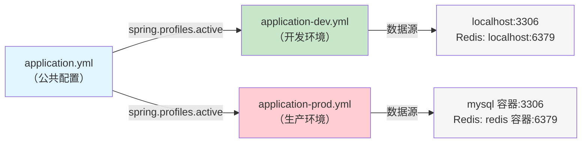
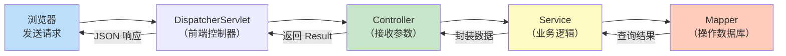
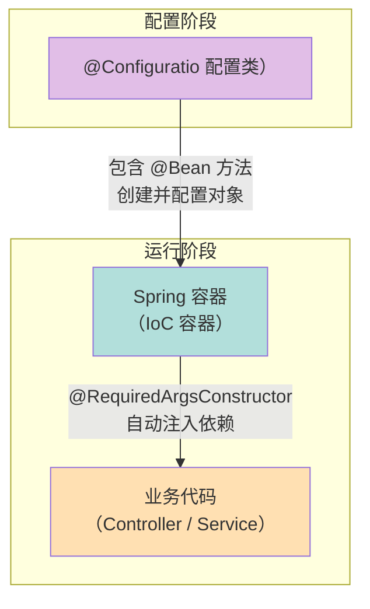

# 第一课：项目骨架与基础概念

> 学完这课，你会明白一个 Spring Boot 项目是怎么组装起来的，以及每一行配置在干什么。

---

## 目录

1. [前置知识](#1-前置知识)
2. [概念讲解](#2-概念讲解)
3. [代码逐行解读](#3-代码逐行解读)
4. [关键 Java 语法点](#4-关键-java-语法点)
5. [动手练习建议](#5-动手练习建议)

---

## 1. 前置知识

在正式开始之前，我们先确认你需要掌握哪些 Java 基础。如果下面有些概念你不太熟，别慌，我会简单帮你补。

### 1.1 你应该已经会的东西

- **类和对象**：知道 `class` 怎么写，`new` 是什么意思
- **访问修饰符**：`public`、`private`、`protected` 的区别
- **基本数据类型**：`int`、`String`、`boolean` 等
- **集合框架**：用过 `List`、`Map`，知道它们能存多个数据
- **接口（interface）**：知道接口定义了一组方法签名，实现类负责具体逻辑

### 1.2 可能需要补的概念

#### 泛型（Generics）

你肯定见过这种写法：`List<String>`。这里的 `<String>` 就是泛型。

泛型的本质就是**让类型也变成参数**。就像方法可以接收不同的值一样，泛型让类或方法可以接收不同的类型。

```java
// 不用泛型：一个盒子只能装 String
class StringBox {
    private String value;
    public void set(String value) { this.value = value; }
    public String get() { return value; }
}

// 用泛型：一个盒子能装任何类型
class Box<T> {         // T 是"类型参数"，就像数学里的 x
    private T value;
    public void set(T value) { this.value = value; }
    public T get() { return value; }
}

// 使用的时候再决定 T 是什么类型
Box<String> stringBox = new Box<>();   // T = String
Box<Integer> intBox = new Box<>();     // T = Integer
```

本项目中的 `Result<T>` 就用了泛型——它让同一个 `Result` 类既能包装 `User` 对象，也能包装 `List<Bookmark>` 列表。

#### 枚举（enum）

枚举是一种特殊的类，用来定义**一组固定的常量**。

```java
// 普通方式：用数字表示星期（不直观，容易写错）
int day = 1;  // 1 是周一还是周日？

// 枚举方式：一目了然
enum Weekday {
    MON, TUE, WED, THU, FRI, SAT, SUN
}
Weekday today = Weekday.MON;  // 不可能写错
```

枚举还能携带字段，本项目的 `ErrorCode` 就是这么做的：每个错误码不仅有个名字（如 `USER_EXISTS`），还有数字编码和描述信息。

#### 静态方法和静态变量（static）

`static` 意味着这个东西**属于类本身，而不是某个对象**。

```java
class MathUtils {
    // 静态方法：不需要 new MathUtils() 就能调用
    public static int add(int a, int b) {
        return a + b;
    }
}

// 直接通过类名调用
int result = MathUtils.add(1, 2);
```

本项目中 `Result.success()` 和 `Result.error()` 都是静态方法，你不需要先 `new Result()` 再设值，直接一行搞定。

#### 注解（Annotation）

注解是加在代码上的"标签"，以 `@` 开头。

```java
@Override          // 告诉编译器：我确实在重写父类方法，别搞错了
public String toString() {
    return "hello";
}
```

注解本身不执行逻辑，但可以被框架读取并做出相应行为。Spring Boot 里到处都是注解，你会在后面的代码中大量见到。

---

## 2. 概念讲解

### 2.1 Maven 是什么

如果你学过前端，Maven 就相当于 Java 世界里的 **npm**（Node.js）或 **pip**（Python）。

但它比 npm 多做了一件事：它不仅是**包管理器**（帮你下载依赖库），还是**构建工具**（帮你编译、测试、打包）。

Maven 的核心文件是 `pom.xml`（Project Object Model）。你在里面声明"我需要哪些库"，Maven 就会自动从中央仓库下载它们。

```
pom.xml  ≈  package.json（前端）
mvn install  ≈  npm install
mvn package  ≈  npm run build
```

Maven 有一个关键概念叫 **坐标**，由三部分组成：

- **groupId**：组织或公司的标识，如 `com.hlaia`
- **artifactId**：项目的名称，如 `HLAIANavigationBar`
- **version**：版本号，如 `0.0.1-SNAPSHOT`

这三个组合在一起就能唯一定位一个库，就像经纬度能唯一定位地球上的一点。

### 2.2 Spring Boot 是什么

Spring 是 Java 后端最流行的框架，但原始的 Spring 配置起来非常繁琐——你要写大量的 XML 文件。

Spring Boot 的设计哲学是**约定优于配置**（Convention over Configuration）。意思是：

- 别人已经定好了一套合理的默认值
- 你只需要在需要改的地方写配置
- 大部分情况下你什么都不用配就能跑起来

比如，Spring Boot 默认内嵌了 Tomcat 服务器，你不需要单独安装和配置 Tomcat，直接运行 `main` 方法就能启动一个 Web 服务器。

一句话总结：**Spring Boot 让你用最少的配置搭建一个可运行的 Spring 应用**。

### 2.3 三层架构

三层架构是后端最经典的代码组织方式。你可以把它想象成一家餐厅：

```
┌──────────────────────────────────────────────────┐
│                  Controller 层                    │
│               （前台接待员）                        │
│   接收请求、校验参数、调用 Service、返回响应          │
├──────────────────────────────────────────────────┤
│                   Service 层                      │
│                 （厨师）                           │
│        处理业务逻辑、组合数据操作                     │
├──────────────────────────────────────────────────┤
│                   Mapper 层                       │
│               （仓库管理员）                        │
│           直接和数据库打交道                         │
└──────────────────────────────────────────────────┘
```

- **Controller（接待员）**：负责接待客人（接收 HTTP 请求），记录点什么菜（提取参数），把需求传达给厨师（调用 Service），最后把菜端给客人（返回响应）。他不关心菜怎么做。
- **Service（厨师）**：负责做菜（业务逻辑）。他决定炒菜的步骤和调料配比，如果需要食材就让仓库管理员去拿（调用 Mapper）。
- **Mapper（仓库管理员）**：负责管理仓库（数据库）。他只管存东西和取东西，不关心取出来的东西要怎么用。

为什么要分层？因为**职责清晰，修改方便**。比如你想换一种数据库（从 MySQL 换成 PostgreSQL），只需要改 Mapper 层，Controller 和 Service 完全不用动。

### 2.4 Profile 机制（多环境配置）

在实际开发中，你的项目至少会运行在两个地方：

- **开发环境**（dev）：你自己的电脑，数据库在本地的 NAS 上
- **生产环境**（prod）：部署到服务器上，数据库在 Docker 容器里

这两个环境的数据库地址、密码等配置通常不一样。Spring Boot 的 **Profile** 机制让你为不同环境准备不同的配置文件，然后在启动时选择激活哪一个。

```
application.yml        ← 公共配置（所有环境都生效）
application-dev.yml    ← 开发环境专用配置
application-prod.yml   ← 生产环境专用配置
```

激活方式很简单，在 `application.yml` 里写一行：

```yaml
spring:
  profiles:
    active: dev    # 当前使用开发环境配置
```

启动时也可以通过命令行参数覆盖：`--spring.profiles.active=prod`。

Profile 的配置会**覆盖**公共配置中相同的项。所以公共配置里放不变的值，环境配置里放会变的值。

### 2.5 YAML 格式基础

YAML（发音 "yamel"）是一种配置文件格式，用**缩进**表示层级关系。

```yaml
# 这是一个 YAML 示例
server:
  port: 8080           # server 下面有 port，值是 8080
spring:
  datasource:
    url: jdbc:mysql://localhost:3306/mydb    # spring → datasource → url
    username: root
    password: 123456
```

几个要点：

- 用**空格缩进**表示层级（不能用 Tab！）
- 冒号后面必须有一个空格：`port: 8080`，不能写 `port:8080`
- `#` 开头的是注释

对比 JSON 更直观：

```json
// 同样的内容用 JSON 写
{
  "server": {
    "port": 8080
  },
  "spring": {
    "datasource": {
      "url": "jdbc:mysql://localhost:3306/mydb",
      "username": "root",
      "password": "123456"
    }
  }
}
```

YAML 更简洁、更易读，Spring Boot 默认使用 YAML 作为配置文件格式。

---

## 3. 代码逐行解读

### 3.1 pom.xml — 项目的"购物清单"

`pom.xml` 告诉 Maven："我要哪些依赖，怎么构建这个项目。"

```xml
<parent>
    <groupId>org.springframework.boot</groupId>
    <artifactId>spring-boot-starter-parent</artifactId>
    <version>4.0.5</version>
</parent>
```

**parent** 意味着"继承"。我们的项目继承了 `spring-boot-starter-parent`，就像继承了一个父类的默认配置——它帮你预设好了常用依赖的版本号、编译参数等。有了它，你就不需要手动指定每个依赖的版本了。

```xml
<properties>
    <java.version>17</java.version>
    <jjwt.version>0.12.6</jjwt.version>
    <mybatis-plus.version>3.5.9</mybatis-plus.version>
    <knife4j.version>4.5.0</knife4j.version>
</properties>
```

**properties** 是自定义变量。你在这里定义一次版本号，后面可以用 `${mybatis-plus.version}` 引用它，避免在多处重复写同一个版本。

接下来是依赖列表，我挑几个关键的讲：

| 依赖 | 作用 |
|------|------|
| `spring-boot-starter-web` | Web 开发基础包，内含嵌入式 Tomcat + Spring MVC。没有它你的应用就不是 Web 应用 |
| `spring-boot-starter-security` | 安全框架，提供认证（你是谁）和授权（你能做什么）功能 |
| `spring-boot-starter-data-redis` | Redis 支持，用于缓存、会话存储等 |
| `spring-boot-starter-validation` | 参数校验，用注解就能校验请求参数（如 `@NotBlank`） |
| `spring-aspects` | AOP（面向切面编程）支持，用于日志、限流等横切关注点 |
| `jjwt-api / jjwt-impl / jjwt-jackson` | JWT Token 的生成和解析库。注意 `jjwt-impl` 和 `jjwt-jackson` 的 `<scope>runtime</scope>` 表示只在运行时需要，编译时用不到 |
| `mybatis-plus-spring-boot3-starter` | ORM 框架，让你用 Java 对象操作数据库，不用手写 SQL |
| `mybatis-plus-jsqlparser` | 分页插件的依赖，MyBatis-Plus 3.5.9 把分页功能拆成了独立模块 |
| `mysql-connector-j` | MySQL 数据库驱动，Java 连接 MySQL 必须有它 |
| `flyway-core / flyway-mysql` | 数据库迁移工具，用版本化的 SQL 脚本管理数据库结构变更 |
| `spring-kafka` | 消息队列支持，用于异步处理（如操作日志的异步写入） |
| `knife4j-openapi3-jakarta-spring-boot-starter` | API 文档生成工具，自动生成接口文档和调试页面 |
| `lombok` | 减少样板代码的工具，自动生成 getter/setter/构造方法等 |

注意 `scope` 这个概念：

- `runtime`：只在运行时需要（如数据库驱动，你写代码时不会直接 import 它）
- `test`：只在测试时需要（如 JUnit、H2 内存数据库）
- 不写 scope：默认是 `compile`，编译和运行都需要

最后是构建插件：

```xml
<build>
    <plugins>
        <plugin>
            <groupId>org.springframework.boot</groupId>
            <artifactId>spring-boot-maven-plugin</artifactId>
        </plugin>
    </plugins>
</build>
```

`spring-boot-maven-plugin` 的作用是把你的项目打包成一个**可执行的 JAR 文件**。有了它，你可以用 `java -jar app.jar` 一行命令启动整个应用，不需要外部服务器。

### 3.2 HlaiaNavigationBarApplication.java — 一切的起点

```java
package com.hlaia;

import org.springframework.boot.SpringApplication;
import org.springframework.boot.autoconfigure.SpringBootApplication;
import org.springframework.scheduling.annotation.EnableScheduling;

@SpringBootApplication
@EnableScheduling
public class HlaiaNavigationBarApplication {

    public static void main(String[] args) {
        SpringApplication.run(HlaiaNavigationBarApplication.class, args);
    }
}
```

这是整个项目的入口。逐行来看：

**`package com.hlaia;`**

声明这个类所在的包。包就像是文件夹，用来组织类文件。`com.hlaia` 是本项目的根包，所有代码都在它下面。

**`@SpringBootApplication`**

这是一个**组合注解**，它其实是三个注解的合体：

- `@SpringBootConfiguration`：表明这是一个配置类
- `@EnableAutoConfiguration`：让 Spring Boot 根据依赖自动配置（比如你引入了 `spring-boot-starter-web`，它就自动配置 Web 服务器）
- `@ComponentScan`：让 Spring 自动扫描当前包及子包下的组件（带 `@Component`、`@Service`、`@Controller` 等注解的类）

一个注解搞定三件事，这就是 Spring Boot 的"约定优于配置"。

**`@EnableScheduling`**

开启定时任务支持。加了这个注解后，Spring 会扫描所有带 `@Scheduled` 注解的方法并按时执行。不加这个注解的话，定时任务的代码不会报错，但就是不会执行——这是一个很常见的坑。

**`SpringApplication.run(...)`**

这一行做了很多事情：启动 Spring 容器、自动配置、内嵌 Tomcat 服务器、扫描组件……你能想到的初始化工作都在这里面了。`args` 参数让你可以通过命令行传入配置（如 `--server.port=9090`）。

### 3.3 application.yml — 公共配置

```yaml
server:
  port: 8080

spring:
  application:
    name: HLAIANavigationBar
  profiles:
    active: dev
```

只有三样东西：

1. **端口号**：`port: 8080`，应用启动后监听 8080 端口。打开浏览器访问 `http://localhost:8080` 就能连上。
2. **应用名称**：`name: HLAIANavigationBar`，给应用起个名字，在日志和监控中会用到。
3. **激活的 Profile**：`active: dev`，当前使用开发环境配置。部署到生产环境时改成 `prod`。

为什么这个文件这么短？因为大部分配置都被放在了环境专用的文件里。`application.yml` 只放"不管什么环境都一样"的东西。

### 3.4 application-dev.yml — 开发环境配置

这个文件配置了你本地开发时连接的各种服务。

**数据库配置：**

```yaml
spring:
  datasource:
    url: jdbc:mysql://192.168.8.6:3306/hlaia_nav_dev?useUnicode=true&characterEncoding=utf-8&serverTimezone=Asia/Shanghai
    username: hlaia
    password: hlaia123
    driver-class-name: com.mysql.cj.jdbc.Driver
```

- `url`：数据库连接地址。`192.168.8.6:3306` 是 NAS 上 MySQL 的地址和端口，`hlaia_nav_dev` 是数据库名。问号后面是连接参数：支持中文（`useUnicode`）、UTF-8 编码（`characterEncoding`）、时区设为上海（`serverTimezone`）。
- `driver-class-name`：JDBC 驱动类名，告诉 Java 用哪个驱动来连接 MySQL。

**Redis 配置：**

```yaml
  data:
    redis:
      host: 192.168.8.6
      port: 6379
      key-prefix: "dev:"
```

Redis 是一个内存数据库，本项目用它来存储 JWT Token 的黑名单和用户会话。`key-prefix: "dev:"` 给所有 Redis 键加上前缀，避免多个环境共用同一个 Redis 时键名冲突。

**Kafka 配置：**

```yaml
  kafka:
    bootstrap-servers: 192.168.8.6:9092
    producer:
      key-serializer: org.apache.kafka.common.serialization.StringSerializer
      value-serializer: org.apache.kafka.common.serialization.StringSerializer
    consumer:
      group-id: hlaia-nav-dev
      key-deserializer: org.apache.kafka.common.serialization.StringDeserializer
      value-deserializer: org.apache.kafka.common.serialization.StringDeserializer
      auto-offset-reset: earliest
```

Kafka 是消息队列，本项目用它来异步处理操作日志。你暂时只需要知道：

- `bootstrap-servers`：Kafka 服务器地址
- `producer` 的 serializer：生产者发送消息时把数据序列化成字符串
- `consumer` 的 deserializer：消费者收到消息时把字符串反序列化成数据
- `group-id`：消费者组名，同一组的消费者共同分担消息

**MyBatis-Plus 配置：**

```yaml
mybatis-plus:
  configuration:
    map-underscore-to-camel-case: true
    log-impl: org.apache.ibatis.logging.stdout.StdOutImpl
  global-config:
    db-config:
      id-type: auto
```

- `map-underscore-to-camel-case: true`：自动把数据库的下划线命名转成 Java 的驼峰命名。比如数据库字段 `created_at` 自动映射到 Java 属性 `createdAt`。
- `log-impl`：开发环境打印 SQL 日志到控制台，方便调试。生产环境不用这个，因为会影响性能。
- `id-type: auto`：主键自增策略，由数据库自动生成 ID。

**JWT 配置：**

```yaml
jwt:
  secret: hlaia-navigation-bar-secret-key-must-be-at-least-256-bits-long-for-hs256-algorithm
  access-token-expiration: 86400000
  refresh-token-expiration: 604800000
```

- `secret`：JWT 签名的密钥，必须足够长（至少 256 位）以保证安全性
- `access-token-expiration`：访问令牌有效期，86400000 毫秒 = 24 小时
- `refresh-token-expiration`：刷新令牌有效期，604800000 毫秒 = 7 天

### 3.5 application-prod.yml — 生产环境配置

```yaml
spring:
  datasource:
    url: jdbc:mysql://mysql:3306/hlaia_nav?...
```

注意看，这里的 MySQL 地址不再是 `192.168.8.6` 而是 `mysql`。这是因为生产环境跑在 Docker 里，`mysql` 是 Docker 容器的名字，Docker 内部网络会自动把 `mysql` 解析成对应容器的 IP 地址。同理，Redis 的地址也变成了 `redis`，Kafka 的地址变成了 `kafka`。

还有一个重要的区别在 JWT 配置：

```yaml
jwt:
  secret: ${JWT_SECRET:hlaia-navigation-bar-secret-key-must-be-at-least-256-bits-long-for-hs256-algorithm}
```

`${JWT_SECRET:默认值}` 的意思是：先从环境变量里找 `JWT_SECRET`，找不到就用冒号后面的默认值。这样你可以在部署时通过环境变量传入真正的密钥，而不用把密钥硬编码在配置文件里（更安全）。

开发环境配置里也有一个细微差别：日志级别是 `debug`（看到所有调试信息），而生产环境是 `info`（只看重要信息，减少日志量）。

### 3.6 MyBatisPlusConfig.java — 分页插件配置

```java
@Configuration
public class MyBatisPlusConfig {

    @Bean
    public MybatisPlusInterceptor mybatisPlusInterceptor() {
        MybatisPlusInterceptor interceptor = new MybatisPlusInterceptor();
        interceptor.addInnerInterceptor(new PaginationInnerInterceptor(DbType.MYSQL));
        return interceptor;
    }
}
```

**`@Configuration`** 告诉 Spring："这个类里面定义了一些 Bean，请你读一下。"

**`@Bean`** 告诉 Spring："这个方法的返回值是一个 Bean，请你管理起来。" 等号右边 `new` 出来的对象不归 Spring 管，但加了 `@Bean` 之后，Spring 会接管它的生命周期——在需要的地方自动注入，在应用关闭时自动销毁。

**为什么要配置分页插件？**

MyBatis-Plus 的 `selectPage` 方法本身不会自动加 `LIMIT` 语句。你需要注册一个分页拦截器，它会在 SQL 执行前自动拼接 `LIMIT offset, size`。没有这个插件，分页查询会返回全部数据——在数据量大的时候会拖垮数据库。

**`DbType.MYSQL`** 告诉拦截器生成 MySQL 语法的分页 SQL。不同数据库的分页语法不一样（MySQL 用 `LIMIT`，Oracle 用 `ROWNUM`，PostgreSQL 用 `LIMIT ... OFFSET`），所以需要指定。

### 3.7 Result.java — 统一响应包装

这是整个项目所有 API 返回值的统一格式。

先看类的声明：

```java
@Data
public class Result<T> implements Serializable {
    private int code;
    private String message;
    private T data;
}
```

三个字段：
- `code`：状态码，200 表示成功，其他表示各种错误
- `message`：提示信息
- `data`：实际数据，用泛型 `T` 表示可以是任何类型

`@Data` 是 Lombok 注解，自动生成 getter、setter、toString、equals、hashCode 方法。没有它的话，你要手写十几个方法，类文件会变得又长又无聊。

`implements Serializable` 表示这个类的对象可以被序列化（转成字节流）。Web 应用中，对象在网络传输和 Redis 缓存时都需要序列化。

然后看静态工厂方法。所谓"工厂方法"，就是用静态方法来创建对象，而不是直接调构造方法：

```java
// 成功，不携带数据（用于删除、更新等操作）
public static <T> Result<T> success() {
    return success(null);
}

// 成功，携带数据（用于查询操作）
public static <T> Result<T> success(T data) {
    Result<T> r = new Result<>();
    r.setCode(200);
    r.setMessage("success");
    r.setData(data);
    return r;
}

// 失败，通过数字错误码和信息
public static <T> Result<T> error(int code, String message) {
    Result<T> r = new Result<>();
    r.setCode(code);
    r.setMessage(message);
    return r;
}

// 失败，通过 ErrorCode 枚举（推荐）
public static <T> Result<T> error(ErrorCode errorCode) {
    return error(errorCode.getCode(), errorCode.getMessage());
}
```

为什么要用工厂方法而不是直接 `new Result()` 然后一个个设值？

1. **简洁**：`return Result.success(user);` 一行搞定，不用写四五行代码
2. **一致**：所有成功响应的 code 都是 200、message 都是 "success"，不会因为手抖写错
3. **灵活**：提供了多个重载方法，适应不同的调用场景

最终返回给前端的 JSON 长这样：

```json
// 成功
{"code": 200, "message": "success", "data": {"id": 1, "username": "admin"}}

// 失败
{"code": 1002, "message": "Invalid username or password", "data": null}
```

前端只需要按同一种格式解析所有接口的返回值，代码干净又不容易出错。这就是"统一响应封装"的设计思想。

---

## 4. 关键 Java 语法点

### 4.1 泛型方法

在 Result.java 中你会看到这种写法：

```java
public static <T> Result<T> success(T data) {
    Result<T> r = new Result<>();
    // ...
    return r;
}
```

注意方法签名中 `<T>` 出现了两次——一次在 `static` 后面（声明类型参数），一次在 `Result<T>` 前面（使用类型参数）。

这叫**泛型方法**。它和泛型类的区别是：泛型类的 `T` 在声明类时就确定了，而泛型方法的 `T` 在调用方法时才确定。

```java
// 调用的时候，T 根据传入参数的类型自动推断
Result<User> r1 = Result.success(user);          // T = User
Result<List<Bookmark>> r2 = Result.success(list); // T = List<Bookmark>
Result<Void> r3 = Result.success();               // T = Void（无数据）
```

### 4.2 静态工厂方法模式

`Result` 类没有暴露 `public` 的构造方法，而是用一组 `static` 方法来创建对象。这是一种经典的设计模式——**静态工厂方法**（Static Factory Method）。

好处有三：

1. **有名字**：`Result.success()` 和 `Result.error()` 比构造方法更能表达意图
2. **可以返回子类**：虽然本项目没用到，但工厂方法可以返回任何子类型的对象
3. **可以缓存实例**：理论上 `success()` 可以每次返回同一个对象（本项目没这么做）

Java 标准库也大量使用了这个模式：

```java
// java.time 包
LocalDate.now();                          // 不是 new LocalDate()
LocalDate.of(2026, 4, 18);               // 不是 new LocalDate(2026, 4, 18)

// java.util.List
List.of("a", "b", "c");                  // 不是 new ArrayList<>(...)
```

### 4.3 @Bean 注解和方法注入

```java
@Configuration
public class MyBatisPlusConfig {
    @Bean
    public MybatisPlusInterceptor mybatisPlusInterceptor() {
        MybatisPlusInterceptor interceptor = new MybatisPlusInterceptor();
        interceptor.addInnerInterceptor(new PaginationInnerInterceptor(DbType.MYSQL));
        return interceptor;
    }
}
```

Spring 的核心概念是 **IoC（控制反转）容器**。传统方式是你自己 `new` 对象、自己管理对象的生命周期；Spring 的方式是你告诉 Spring"我需要一个什么对象"，Spring 帮你创建和管理。

`@Bean` 就是告诉 Spring 的一种方式。这个方法的返回值会被 Spring 容器管理，其他地方需要用的时候，Spring 会自动注入（`@Autowired` 或构造方法注入）。

```
没有 Spring：
    你自己：interceptor = new MybatisPlusInterceptor();  // 你负责创建
    你自己：用完之后自己清理                               // 你负责销毁

有 Spring：
    你告诉 Spring：@Bean 方法返回一个 MybatisPlusInterceptor
    Spring：好，我帮你创建、帮你注入到需要的地方、用完帮你销毁
```

### 4.4 @Configuration 注解

`@Configuration` 标记的类是一个"配置类"，它的作用相当于早期 Spring 中的 XML 配置文件。Spring Boot 启动时会扫描所有 `@Configuration` 类，读取里面的 `@Bean` 定义，创建对应的对象。

```java
// 以前用 XML 配置（你不需要看懂，了解就好）
<bean id="mybatisPlusInterceptor" class="com.baomidou.mybatisplus.extension.plugins.MybatisPlusInterceptor">
    ...
</bean>

// 现在用 Java 注解配置（更简洁、有类型检查）
@Configuration
public class MyBatisPlusConfig {
    @Bean
    public MybatisPlusInterceptor mybatisPlusInterceptor() { ... }
}
```

### 4.5 Lombok 注解

本项目用了两个 Lombok 注解：

**`@Data`**（用在 Result.java 上）：
自动生成以下方法：
- 所有字段的 getter 和 setter
- `toString()` 方法
- `equals()` 和 `hashCode()` 方法
- 一个包含所有字段的构造方法（不包含无参构造）

**`@Getter` + `@AllArgsConstructor`**（用在 ErrorCode.java 上）：
- `@Getter`：只生成 getter 方法
- `@AllArgsConstructor`：生成包含所有字段的构造方法

Lombok 在编译时自动帮你生成这些方法，你写的代码少了，但编译后的 `.class` 文件里这些方法一个不少。

---

## 5. 动手练习建议

### 练习 1：修改端口号

打开 `application.yml`，把 `port: 8080` 改成 `port: 9090`。然后启动应用，验证是否在 9090 端口运行。

思考：如果你想在命令行启动时临时指定端口，应该怎么写？（提示：`--server.port=xxxx`）

### 练习 2：理解 Profile 切换

1. 把 `application.yml` 中的 `active: dev` 改成 `active: prod`
2. 观察启动日志，看数据库连接地址变成了什么
3. 把它改回 `dev`（因为你的开发环境连不上 Docker 内部的 `mysql` 地址）

思考：为什么不建议在 `application-prod.yml` 里直接写密码？

### 练习 3：为 Result 类添加一个新方法

在 `Result.java` 中添加一个方法，创建一个"自定义消息的成功响应"：

```java
/**
 * 创建带自定义消息的成功响应
 * 例如：Result.successWithMessage("删除成功")
 */
public static <T> Result<T> successWithMessage(String message) {
    // 请自己补充实现
}
```

要求：调用 `Result.successWithMessage("删除成功")` 后，返回的 JSON 为：
`{"code": 200, "message": "删除成功", "data": null}`

### 练习 4：添加一个自定义错误码

打开 `ErrorCode.java`，添加一个你自己的错误码：

```java
// 在业务相关错误区域添加
YOUR_ERROR(2099, "Your custom error message"),
```

然后在任意地方尝试调用 `Result.error(ErrorCode.YOUR_ERROR)`，看返回的 JSON 是什么。

### 练习 5：画一个架构图

拿出纸和笔（或用你喜欢的画图工具），画出以下关系：

1. `application.yml`、`application-dev.yml`、`application-prod.yml` 三个文件的关系
2. 一个 HTTP 请求从进入应用到返回响应，依次经过 Controller → Service → Mapper 的流程
3. `@Configuration`、`@Bean`、`Spring 容器`、`业务代码` 之间的关系

不用画得漂亮，自己能看懂就行。画图是理解架构最有效的方式之一。

> **参考答案**

**第 1 题：Spring Boot 配置文件关系**



**第 2 题：HTTP 请求处理流程**



**第 3 题：Spring IoC 容器与依赖注入**



---

> 下一课预告：我们将进入实体类（Entity）和数据访问层（Mapper）的学习，看看 Java 对象是怎么映射到数据库表的。
