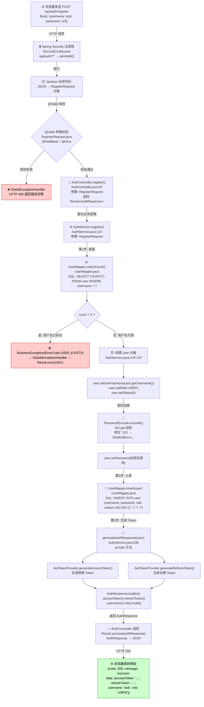

# 阶段 02：一个 HTTP 请求的完整旅程 —— 用户注册链路详解

> 前置要求：已完成阶段 01（项目骨架与基础概念），了解 Spring Boot 项目的基本目录结构。
>
> 本阶段我们将追踪一个 HTTP 请求从浏览器发出、到后端处理、再到数据库写入并返回响应的完整过程。
> 以「用户注册」功能为例，逐行讲解涉及的每一个文件。

---

## 目录

1. [前置知识回顾](#1-前置知识回顾)
2. [概念讲解](#2-概念讲解)
3. [代码逐行解读（按请求流转顺序）](#3-代码逐行解读按请求流转顺序)
4. [关键 Java 语法点](#4-关键-java-语法点)
5. [动手练习建议](#5-动手练习建议)

---

## 1. 前置知识回顾

在开始追踪请求之前，你需要理解以下几个 Java 基础概念。如果你已经熟悉，可以快速跳过。

### 1.1 类和对象

```java
// 类是"设计图纸"，对象是按图纸造出来的"实物"
public class User {        // 这是类（图纸）
    private String name;   // 图纸上的一个属性
}

User u = new User();       // 用 new 关键字造出一个对象（实物）
u.setName("alice");        // 给这个对象设置属性
```

**为什么提这个？** 因为 Spring Boot 的核心就是"创建对象、管理对象、让对象之间互相协作"。Controller、Service、Mapper 都是对象，Spring 帮你 new 出来的。

### 1.2 接口（Interface）

```java
// 接口是一份"合同"，只规定"要做什么"，不规定"怎么做"
public interface BaseMapper<T> {
    int insert(T entity);     // 只声明方法，没有方法体
    T selectById(Serializable id);
}

// 实现类才真正写"怎么做"
public class UserMapperImpl implements BaseMapper<User> {
    public int insert(User entity) {
        // 真正的数据库操作代码...
    }
}
```

**为什么提这个？** 我们的 `UserMapper` 继承了 `BaseMapper<User>` 接口，MyBatis-Plus 会自动生成实现类，所以我们不需要自己写 SQL。

### 1.3 注解（Annotation）

```java
@Data                    // 告诉 Lombok："帮我自动生成 getter/setter"
@RequiredArgsConstructor // 告诉 Lombok："帮我生成一个包含所有 final 字段的构造方法"
@Service                 // 告诉 Spring："这是一个 Service 类，请管理它"
@PostMapping("/register")// 告诉 Spring："当前端 POST 请求 /register 时，调用这个方法"
```

注解就像是给代码贴的"便利贴"，告诉编译器或框架："在这里做点额外的事情"。你不需要理解框架具体怎么处理，只需要知道贴了什么注解，框架就会帮你做什么。

### 1.4 泛型（Generics）

```java
// 泛型就是"类型参数"，让一个类可以适配多种类型
Result<AuthResponse>  // Result 里装的是 AuthResponse 类型的数据
Result<Void>          // Result 里不装任何数据
Result<List<User>>    // Result 里装的是 User 列表

// 类比：Result 就像一个快递箱，泛型就是箱子上写的"里面装的是什么"
```

### 1.5 枚举（Enum）

```java
// 枚举是一种特殊的类，只有固定数量的实例
public enum ErrorCode {
    USER_EXISTS(1001, "Username already exists"),
    // ... 其他错误码

    private final int code;
    private final String message;
}
```

枚举确保你不会写错错误码。`ErrorCode.USER_EXISTS` 比 `1001` 可读性好得多，而且编译器会帮你检查拼写。

---

## 2. 概念讲解

### 2.1 请求流转链路：一个注册请求的完整旅程

当用户在浏览器点击"注册"按钮时，发生了什么？我们来画一张路线图：

```
浏览器                        后端 Spring Boot                        数据库
  |                               |                                    |
  |  POST /api/auth/register      |                                    |
  |  Body: {"username":"alice",   |                                    |
  |         "password":"123456"}  |                                    |
  |──────────────────────────────>|                                    |
  |                               |                                    |
  |     ① Spring MVC 路由匹配     |                                    |
  |        URL 匹配到 AuthController.register()                       |
  |                               |                                    |
  |     ② Jackson 反序列化        |                                    |
  |        JSON → RegisterRequest 对象                                 |
  |                               |                                    |
  |     ③ @Valid 参数校验         |                                    |
  |        检查 @NotBlank @Size 校验规则                                |
  |        校验失败 → GlobalExceptionHandler 返回 400 错误             |
  |                               |                                    |
  |     ④ Controller 调用 Service |                                    |
  |        authService.register(request)                               |
  |                               |                                    |
  |     ⑤ Service 执行业务逻辑    |                                    |
  |        检查用户名是否已存在 ────────────────────────────────────────>|
  |                               |         SELECT COUNT(*) FROM user   |
  |                               |<────────────────────────────────────|
  |                               |                                    |
  |        创建 User 对象         |                                    |
  |        加密密码（BCrypt）     |                                    |
  |                               |                                    |
  |        插入数据库 ─────────────────────────────────────────────────>|
  |                               |         INSERT INTO user (...)      |
  |                               |<────────────────────────────────────|
  |                               |                                    |
  |        生成 JWT Token         |                                    |
  |        构建返回结果           |                                    |
  |                               |                                    |
  |     ⑥ Result 统一响应封装    |                                    |
  |                               |                                    |
  |  HTTP 200 OK                  |                                    |
  |  {"code":200,                 |                                    |
  |   "message":"success",        |                                    |
  |   "data":{"accessToken":"..", |                                    |
  |           "username":"alice"}}|                                    |
  |<──────────────────────────────|                                    |
```

这个链路涉及 7 个文件，我们按流转顺序逐个讲解。

### 2.2 三层架构实战

Spring Boot 项目最经典的架构就是三层架构：

```
┌─────────────────────────────────────────────┐
│              Controller 层                   │
│  职责：接收请求、参数校验、调用 Service、返回响应    │
│  类比：餐厅服务员（点单、上菜）                   │
│  文件：AuthController.java                    │
├─────────────────────────────────────────────┤
│              Service 层                      │
│  职责：执行业务逻辑（检查规则、处理数据）            │
│  类比：后厨厨师（做菜、调味）                     │
│  文件：AuthService.java                       │
├─────────────────────────────────────────────┤
│              Mapper 层                       │
│  职责：数据库操作（增删改查）                      │
│  类比：仓库管理员（取食材、存食材）                 │
│  文件：UserMapper.java                        │
└─────────────────────────────────────────────┘
```

**为什么要分层？** 假设你把所有代码都写在 Controller 里，会出现这些问题：

- **不好测试**：测试注册功能时，必须启动整个 Web 服务器
- **不好复用**：管理员创建用户也需要注册逻辑，难道再写一遍？
- **不好维护**：一千行的 Controller，看着头疼

分层后，每层只做一件事，代码清晰、好测试、好复用。

### 2.3 DTO 模式（Data Transfer Object）

你可能会问：既然 `User` 实体类已经有 `username` 和 `password` 字段了，为什么还要单独写一个 `RegisterRequest`？

原因有三：

```
                        前端发来的数据
                            │
                      ┌─────▼──────┐
                      │ RegisterRequest│  ← Request DTO：定义"前端能传什么"
                      │  username    │     只有 username 和 password
                      │  password    │     不能传 role、status（防止提权攻击）
                      └──────┬──────┘
                             │
                      ┌──────▼──────┐
                      │    User      │  ← Entity：定义"数据库存什么"
                      │  id          │     有 id、email、role、status、时间戳
                      │  username    │     字段比 Request DTO 多得多
                      │  password    │
                      │  email       │
                      │  role        │
                      │  status      │
                      │  createdAt   │
                      │  updatedAt   │
                      └──────┬──────┘
                             │
                      ┌──────▼──────┐
                      │ AuthResponse │  ← Response DTO：定义"前端能看到什么"
                      │  accessToken │     只有 Token 和用户基本信息
                      │  refreshToken│     绝对不能返回密码！
                      │  username    │
                      │  role        │
                      └─────────────┘
```

**关键安全原则：**
- Request DTO 限制前端能传什么（不能让用户自己指定 role = "ADMIN"）
- Response DTO 限制前端能看到什么（绝不能把密码返回给前端）
- Entity 是数据库的完整映射（包含所有字段）

如果不用 DTO，直接用 User 接收请求？那恶意用户可以传 `{"username":"alice", "password":"123456", "role":"ADMIN"}`，直接给自己管理员权限！

### 2.4 参数校验的工作原理

看这组注解：

```java
@NotBlank(message = "用户名不能为空")
@Size(min = 3, max = 50, message = "用户名长度必须在3到50个字符之间")
private String username;
```

当 Controller 方法参数加了 `@Valid` 时，Spring 会在进入方法体之前自动检查这些规则：

```
前端发送 JSON → Jackson 反序列化为 RegisterRequest 对象
                     │
                     ▼
              @Valid 触发校验
                     │
            ┌────────┴────────┐
            │                 │
         校验通过           校验失败
            │                 │
     进入方法体         抛出 MethodArgumentNotValidException
                            │
                   GlobalExceptionHandler 捕获
                            │
                   返回 {"code":400, "message":"username: 用户名不能为空"}
```

注意：校验注解放在 DTO 字段上（定义规则），`@Valid` 放在 Controller 方法参数上（触发检查），两者配合使用。

### 2.5 ORM 概念：MyBatis-Plus 如何把 Java 对象映射到数据库表

ORM（Object-Relational Mapping，对象关系映射）的核心思想：**用 Java 对象代替 SQL 操作数据库**。

```
Java 世界                          数据库世界
────────                          ─────────
User 类                 ←映射→     user 表
  id 字段 (Long)        ←映射→     id 列 (BIGINT)
  username 字段 (String) ←映射→    username 列 (VARCHAR(50))
  password 字段 (String) ←映射→    password 列 (VARCHAR(60))
  role 字段 (String)     ←映射→    role 列 (VARCHAR(20))
  status 字段 (Integer)  ←映射→    status 列 (INT)

一个 User 对象            ←映射→     user 表中的一行记录
```

MyBatis-Plus 是怎么知道 User 类对应 user 表的？

```java
@TableName("user")   // 显式指定表名
public class User {
    @TableId(type = IdType.AUTO)  // 指定主键和自增策略
    private Long id;
    private String username;      // 字段名和列名相同时不需要额外注解
}
```

另外，配置文件中还有一条关键配置：

```yaml
mybatis-plus:
  configuration:
    map-underscore-to-camel-case: true   # 数据库的 user_name 自动映射到 Java 的 userName
```

这就是为什么 `createdAt` 字段能自动对应数据库的 `created_at` 列。

### 2.6 密码加密：为什么不能明文存储

假设密码明文存储在数据库里：

| id | username | password |
|----|----------|----------|
| 1  | alice    | 123456   |

一旦数据库被黑客入侵，所有用户的密码直接泄露。而且很多用户在不同网站使用相同密码，一个网站被攻破，其他网站也遭殃。

**BCrypt 加密后的数据库：**

| id | username | password                                                    |
|----|----------|-------------------------------------------------------------|
| 1  | alice    | $2a$10$N9qo8uLOickgx2ZMRZoMyeIjZAgcfl7p92ldGxad68LJZdL17lhWy |

BCrypt 的特点：

1. **单向不可逆**：无法从密文反推出明文。验证密码时不是"解密后比较"，而是"用同样的方式加密明文，看结果是否一致"
2. **自带随机盐值**：每次加密同一个密码，生成的密文都不同。这样即使两个用户的密码都是 "123456"，密文也完全不一样
3. **慢速算法**：故意设计得慢，让暴力破解成本极高

在项目中，Spring Security 提供了 `PasswordEncoder` 接口，默认实现就是 BCrypt：

```java
// 加密（注册时）
String 密文 = passwordEncoder.encode("123456");
// 密文类似：$2a$10$N9qo8uLOickgx2ZMRZoMye...

// 验证（登录时）
boolean 匹配 = passwordEncoder.matches("123456", 密文);  // true
boolean 不匹配 = passwordEncoder.matches("654321", 密文); // false
```

### 2.7 依赖注入：@RequiredArgsConstructor + final 的工作原理

传统方式创建对象：

```java
// 你自己手动 new
AuthService service = new AuthService(
    new UserMapper(),
    new BCryptPasswordEncoder(),
    new JwtTokenProvider(secret, accessExp, refreshExp),
    new StringRedisTemplate()
);
```

问题：你需要知道每个依赖怎么创建，依赖关系变了就要改代码。

Spring 的依赖注入：

```java
@Service
@RequiredArgsConstructor   // Lombok 自动生成构造方法
public class AuthService {
    private final UserMapper userMapper;           // 依赖 1
    private final PasswordEncoder passwordEncoder; // 依赖 2
    private final JwtTokenProvider jwtTokenProvider;// 依赖 3
    private final StringRedisTemplate redisTemplate;// 依赖 4

    // Lombok 自动生成了下面的构造方法（你看不到，但编译后存在）：
    // public AuthService(UserMapper userMapper, PasswordEncoder passwordEncoder,
    //                     JwtTokenProvider jwtTokenProvider, StringRedisTemplate redisTemplate) {
    //     this.userMapper = userMapper;
    //     this.passwordEncoder = passwordEncoder;
    //     this.jwtTokenProvider = jwtTokenProvider;
    //     this.redisTemplate = redisTemplate;
    // }
}
```

Spring 启动时的工作流程：

```
1. Spring 扫描到 @Service 注解 → 知道 AuthService 需要被管理
2. Spring 发现 AuthService 只有一个构造方法（Lombok 生成的）
3. Spring 看到构造方法需要 4 个参数：
   - UserMapper → 找到标注了 @Mapper 的 UserMapper 实现类 → 创建实例
   - PasswordEncoder → 找到 Spring Security 自动配置的 BCrypt 实例
   - JwtTokenProvider → 找到标注了 @Component 的 JwtTokenProvider 实例
   - StringRedisTemplate → 找到 Spring Boot 自动配置的 Redis 模板实例
4. Spring 用这 4 个实例调用构造方法，创建 AuthService 实例
5. 之后任何地方需要 AuthService 时，Spring 直接提供这个已经创建好的实例
```

这就是**控制反转（IoC）**：不是你自己创建对象，而是把创建对象的控制权交给 Spring 框架。

---

## 3. 代码逐行解读（按请求流转顺序）

现在让我们按请求流转的顺序，逐行阅读每个文件。

### 3.1 RegisterRequest.java —— 请求的第一道门

> 文件路径：`src/main/java/com/hlaia/dto/request/RegisterRequest.java`

这是前端发来的 JSON 数据对应的 Java 类，也是请求进入后端后第一个被创建的对象。

```java
package com.hlaia.dto.request;

import jakarta.validation.constraints.NotBlank;
import jakarta.validation.constraints.Size;
import lombok.Data;

@Data
public class RegisterRequest {

    @NotBlank(message = "用户名不能为空")
    @Size(min = 3, max = 50, message = "用户名长度必须在3到50个字符之间")
    private String username;

    @NotBlank(message = "密码不能为空")
    @Size(min = 6, max = 100, message = "密码长度必须在6到100个字符之间")
    private String password;
}
```

**逐行拆解：**

#### `package com.hlaia.dto.request;`
声明这个类所在的包。`dto.request` 表示这是 DTO 中的 Request（请求）部分。DTO 分 Request 和 Response 两种，分开放在不同包里，职责清晰。

#### `import jakarta.validation.constraints.NotBlank;`
导入校验注解。`jakarta` 是 Java EE 被移交给 Eclipse 基金会后的新包名（原来是 `javax`）。Spring Boot 3.x 以上必须用 `jakarta`。

#### `@Data`

Lombok 注解，自动生成以下方法：
- `getUsername()` / `setUsername()` —— getter/setter
- `toString()` —— 方便打印调试
- `equals()` / `hashCode()` —— 用于集合操作

没有 Lombok 的话，你需要手写大约 20 行代码来完成同样的事情。

#### `@NotBlank(message = "用户名不能为空")`
校验注解，规则是"不能为空"。具体来说，`@NotBlank` 拒绝三种值：
- `null`（没有值）
- `""`（空字符串）
- `"   "`（只有空格）

`message` 是校验失败时返回给前端的错误信息。

#### `@Size(min = 3, max = 50, message = "用户名长度必须在3到50个字符之间")`
校验注解，检查字符串长度。注意 `@Size` 允许 `null` 值通过（它只检查长度，不检查是否为空），所以必须和 `@NotBlank` 组合使用。

**为什么 max=50？** 因为数据库 `user` 表的 `username` 列是 `VARCHAR(50)`，超过 50 个字符的数据插入时会报错。校验注解在进入业务逻辑之前就挡住不合法的数据。

#### `private String username;`

一个普通的私有字段。`private` 表示只有这个类内部才能直接访问它（通过 getter/setter 间接访问是允许的）。`String` 是 Java 的字符串类型。

### 3.2 AuthController.java —— 请求的入口

> 文件路径：`src/main/java/com/hlaia/controller/AuthController.java`

Controller 是 HTTP 请求进入后端代码的第一个站点。我们重点看 `register` 方法。

```java
@RestController
@RequestMapping("/api/auth")
@RequiredArgsConstructor
@Tag(name = "Authentication", description = "User authentication APIs")
public class AuthController {

    private final AuthService authService;

    @PostMapping("/register")
    @Operation(summary = "Register a new user")
    public Result<AuthResponse> register(@Valid @RequestBody RegisterRequest request) {
        return Result.success(authService.register(request));
    }
    // ... 其他方法省略
}
```

**逐行拆解：**

#### `@RestController`
告诉 Spring："这个类是一个 REST 控制器"。等价于 `@Controller` + `@ResponseBody`：
- `@Controller`：标记为 Spring MVC 的控制器
- `@ResponseBody`：方法返回值直接作为 HTTP 响应体（自动转 JSON）

如果不加 `@ResponseBody`，Spring 会把返回值当作视图名称去查找 HTML 页面。我们的项目是前后端分离的，只返回 JSON，所以用 `@RestController`。

#### `@RequestMapping("/api/auth")`
给这个 Controller 的所有方法设置 URL 前缀。比如 `register` 方法上的 `@PostMapping("/register")`，最终完整路径是 `/api/auth/register`。

这个前缀的设计有讲究：
- `/api` —— 表示这是 API 接口，不是页面
- `/auth` —— 表示属于认证模块

#### `@RequiredArgsConstructor`
Lombok 注解，为所有 `final` 字段生成构造方法。这个类只有一个 `final` 字段 `authService`，所以 Lombok 生成的构造方法等价于：

```java
public AuthController(AuthService authService) {
    this.authService = authService;
}
```

Spring 会自动调用这个构造方法，把 `AuthService` 的实例传进来（依赖注入）。

#### `@Tag(name = "Authentication", ...)`
Swagger/Knife4j 的注解，在 API 文档页面中给这个 Controller 分组。纯文档用途，不影响代码逻辑。

#### `private final AuthService authService;`
声明一个 `AuthService` 类型的字段，并用 `final` 修饰。`final` 意味着这个字段只能在构造方法中赋值，之后不能再修改。这保证了依赖不可变，是 Spring 推荐的做法。

#### `@PostMapping("/register")`
声明这个方法处理 HTTP POST 请求，路径是 `/register`。结合类上的 `@RequestMapping("/api/auth")`，完整路径是 `POST /api/auth/register`。

为什么用 POST 而不是 GET？因为注册请求包含密码，GET 请求的参数会出现在 URL 里（浏览器地址栏、服务器日志都能看到），不安全。

#### `@Operation(summary = "Register a new user")`
Swagger 注解，在 API 文档中显示这个接口的摘要说明。

#### `public Result<AuthResponse> register(...)`
方法签名。让我们拆解返回类型 `Result<AuthResponse>`：
- `Result` —— 统一响应包装类，包含 `code`、`message`、`data` 三个字段
- `<AuthResponse>` —— 泛型参数，表示 `data` 字段的具体类型是 `AuthResponse`

所有接口都返回 `Result<T>`，前端只需要按同一种格式解析。

#### `@Valid`
触发参数校验。它会检查 `RegisterRequest` 字段上的 `@NotBlank`、`@Size` 等注解。如果校验失败，Spring 会抛出 `MethodArgumentNotValidException`，被 `GlobalExceptionHandler` 捕获后返回 400 错误。校验通过后才会进入方法体。

#### `@RequestBody`
告诉 Spring："从 HTTP 请求体中读取数据，自动转换为 Java 对象"。具体过程是：

```
请求体 JSON：
{"username": "alice", "password": "123456"}
         │
         ▼  Jackson 库自动映射
RegisterRequest 对象：
  username = "alice"
  password = "123456"
```

Jackson 按 JSON 的 key 和 Java 字段名进行匹配，类型自动转换。

#### `return Result.success(authService.register(request));`
这一行做了三件事：
1. 调用 `authService.register(request)` —— 把请求交给 Service 层处理，返回 `AuthResponse`
2. 调用 `Result.success(...)` —— 把 `AuthResponse` 包装成统一响应格式
3. 返回给前端 —— Spring 自动把 `Result<AuthResponse>` 序列化为 JSON

注意 Controller 只做这三件事，不处理任何业务逻辑。这是分层架构的核心原则。

### 3.3 AuthService.java —— 业务逻辑的核心

> 文件路径：`src/main/java/com/hlaia/service/AuthService.java`

Service 层是真正干活的地方。我们只看 `register` 方法：

```java
@Service
@RequiredArgsConstructor
public class AuthService {

    private final UserMapper userMapper;
    private final PasswordEncoder passwordEncoder;
    private final JwtTokenProvider jwtTokenProvider;
    private final StringRedisTemplate redisTemplate;

    public AuthResponse register(RegisterRequest request) {
        // 第一步：检查用户名是否已被注册
        Long count = userMapper.selectCount(
                new LambdaQueryWrapper<User>().eq(User::getUsername, request.getUsername()));
        if (count > 0) {
            throw new BusinessException(ErrorCode.USER_EXISTS);
        }

        // 第二步：创建用户对象并设置属性
        User user = new User();
        user.setUsername(request.getUsername());
        user.setPassword(passwordEncoder.encode(request.getPassword()));
        user.setRole("USER");
        user.setStatus(0);

        // 第三步：保存到数据库
        userMapper.insert(user);

        // 第四步：生成 Token 并返回
        return generateAuthResponse(user);
    }
}
```

**逐行拆解：**

#### `@Service`
告诉 Spring："这是一个 Service 类，请创建并管理它的实例"。和 `@Controller`、`@Repository` 一样，都是 Spring 的组件注解，功能相同，只是名字不同，方便开发者区分角色。

#### 依赖注入的 4 个字段

```java
private final UserMapper userMapper;            // 数据库操作
private final PasswordEncoder passwordEncoder;   // 密码加密/验证
private final JwtTokenProvider jwtTokenProvider; // JWT Token 生成/解析
private final StringRedisTemplate redisTemplate; // Redis 操作（注册时不用，登出时用）
```

这 4 个字段都是 `final` 的，通过 `@RequiredArgsConstructor` 生成的构造方法注入。一眼就能看出 `AuthService` 依赖哪些组件。

#### 第一步：检查用户名是否已存在

```java
Long count = userMapper.selectCount(
        new LambdaQueryWrapper<User>().eq(User::getUsername, request.getUsername()));
```

这行代码等价于 SQL：`SELECT COUNT(*) FROM user WHERE username = 'alice'`

拆解一下：

- `userMapper.selectCount(...)` —— 调用 MyBatis-Plus 提供的"统计数量"方法
- `new LambdaQueryWrapper<User>()` —— 创建一个查询条件构造器，泛型指定查询哪张表（User 对应 user 表）
- `.eq(User::getUsername, request.getUsername())` —— 添加条件 `WHERE username = ?`
  - `User::getUsername` 是方法引用（Lambda 语法），等价于告诉 MyBatis-Plus "看 User 类的 getUsername 方法对应的字段名"
  - 比直接写字符串 `"username"` 更安全：如果字段名改了，编译器会报错

```java
if (count > 0) {
    throw new BusinessException(ErrorCode.USER_EXISTS);
}
```

如果数据库中已经有同名的用户，抛出业务异常。注意这里用 `throw`（抛出异常）而不是 `return`（返回错误响应）。

为什么用 `throw`？因为异常会被 `GlobalExceptionHandler` 统一捕获并转为标准 JSON 响应。这样 Service 层不需要关心"怎么返回错误"，只管"发现错误就抛"。

#### 第二步：创建 User 对象

```java
User user = new User();
user.setUsername(request.getUsername());
user.setPassword(passwordEncoder.encode(request.getPassword()));
user.setRole("USER");
user.setStatus(0);
```

逐行：
- `new User()` —— 创建一个空的 User 对象
- `user.setUsername(request.getUsername())` —— 从 Request DTO 中取出用户名，设置到 Entity
- `passwordEncoder.encode(request.getPassword())` —— 加密密码。`encode()` 每次调用都会产生不同的密文（因为内置随机盐值）
- `user.setRole("USER")` —— 硬编码为 "USER"，**不允许用户自己指定角色**。这就是 DTO 模式的安全意义
- `user.setStatus(0)` —— 0 表示正常状态（未封禁）

注意：`id`、`createdAt`、`updatedAt` 没有设置。`id` 由数据库自增，时间字段由数据库自动填充。

#### 第三步：保存到数据库

```java
userMapper.insert(user);
```

这一行等价于 SQL：

```sql
INSERT INTO user (username, password, role, status)
VALUES ('alice', '$2a$10$N9qo8uLOickgx2ZMRZoMye...', 'USER', 0)
```

MyBatis-Plus 会自动把 User 对象的非空字段拼成 INSERT 语句。插入成功后，`user.getId()` 会自动获得数据库生成的自增 ID。

#### 第四步：生成 Token 并返回

```java
return generateAuthResponse(user);
```

调用私有方法 `generateAuthResponse`，它做了两件事：
1. 调用 `jwtTokenProvider.generateAccessToken(...)` 生成 Access Token（短期，如 24 小时）
2. 调用 `jwtTokenProvider.generateRefreshToken(...)` 生成 Refresh Token（长期，如 7 天）

然后用 Builder 模式构建 `AuthResponse` 对象返回。

为什么要"注册成功即登录"？用户体验设计：注册完再跳到登录页面让用户重新输入密码，体验很差。直接返回 Token，前端保存到本地，用户无缝进入系统。

### 3.4 User.java —— 数据库表的 Java 映射

> 文件路径：`src/main/java/com/hlaia/entity/User.java`

```java
@Data
@TableName("user")
public class User {

    @TableId(type = IdType.AUTO)
    private Long id;

    private String username;
    private String password;
    private String email;

    private String role;

    private Integer status;

    private LocalDateTime createdAt;
    private LocalDateTime updatedAt;
}
```

**逐行拆解：**

#### `@TableName("user")`
告诉 MyBatis-Plus："这个类对应数据库中名为 `user` 的表"。如果不加这个注解，MyBatis-Plus 默认把类名转为小写作为表名（`User` → `user`），所以这个注解其实可以省略，但加上更明确。

#### `@TableId(type = IdType.AUTO)`
标记 `id` 字段为主键，策略为 `AUTO`（数据库自增）。其他策略：
- `ASSIGN_ID`：雪花算法（分布式 ID）
- `INPUT`：手动输入
- `NONE`：由数据库决定

#### `private Long id;`
为什么用 `Long`（包装类型）而不是 `long`（基本类型）？
- 基本类型 `long` 的默认值是 `0`，无法区分"ID 是 0"和"还没设置 ID"
- 包装类型 `Long` 的默认值是 `null`，可以明确表示"还没有 ID"
- 数据库中还没有插入记录时，ID 就应该为 null

#### `private String username;` 等
没有额外注解，MyBatis-Plus 按字段名自动映射到数据库列名。Java 的驼峰命名（`createdAt`）自动映射到数据库的下划线命名（`created_at`），因为配置文件中有 `map-underscore-to-camel-case: true`。

#### `private LocalDateTime createdAt;`
Java 8 提供的日期时间类型，精确到纳秒。对应数据库的 `DATETIME` 类型。比旧的 `java.util.Date` 更好用（不可变、线程安全、API 更友好）。

### 3.5 UserMapper.java —— 不写 SQL 的数据库操作

> 文件路径：`src/main/java/com/hlaia/mapper/UserMapper.java`

```java
@Mapper
public interface UserMapper extends BaseMapper<User> {
    // 不需要写任何方法！
}
```

只有两行有效代码，但功能强大。让我解释为什么。

#### `@Mapper`
告诉 MyBatis："这是一个 Mapper 接口，请为它创建实现类"。MyBatis 会在运行时用**动态代理**（一种高级 Java 技术）自动生成这个接口的实现类。

#### `extends BaseMapper<User>`
继承 MyBatis-Plus 提供的通用 Mapper。泛型 `<User>` 指定操作的实体类型。

继承后自动拥有的方法：

| 方法 | 等价 SQL | 用途 |
|------|----------|------|
| `insert(User entity)` | `INSERT INTO user ...` | 插入一条记录 |
| `deleteById(Long id)` | `DELETE FROM user WHERE id = ?` | 按 ID 删除 |
| `updateById(User entity)` | `UPDATE user SET ... WHERE id = ?` | 按 ID 更新 |
| `selectById(Long id)` | `SELECT * FROM user WHERE id = ?` | 按 ID 查询 |
| `selectCount(wrapper)` | `SELECT COUNT(*) FROM user WHERE ...` | 条件统计数量 |
| `selectOne(wrapper)` | `SELECT * FROM user WHERE ... LIMIT 1` | 条件查询单条 |
| `selectList(wrapper)` | `SELECT * FROM user WHERE ...` | 条件查询列表 |

这些方法全是 MyBatis-Plus 自动实现的，不需要我们写一行 SQL！

### 3.6 AuthResponse.java —— 返回给前端的数据

> 文件路径：`src/main/java/com/hlaia/dto/response/AuthResponse.java`

```java
@Data
@Builder
public class AuthResponse {

    private String accessToken;
    private String refreshToken;
    private String username;
    private String role;
}
```

#### `@Builder`
Lombok 的建造者模式注解。使用方式：

```java
// 不用 Builder（传统方式）
AuthResponse res = new AuthResponse();
res.setAccessToken("eyJhbG...");
res.setRefreshToken("eyJhbG...");
res.setUsername("alice");
res.setRole("USER");

// 用 Builder（链式调用）
AuthResponse res = AuthResponse.builder()
        .accessToken("eyJhbG...")
        .refreshToken("eyJhbG...")
        .username("alice")
        .role("USER")
        .build();
```

Builder 模式的好处：可读性强（一眼看出设置了哪些字段）、不容易漏设字段。

#### 为什么 Response DTO 没有校验注解？

校验注解是给"接收的数据"用的（确保前端传来的数据合法）。Response DTO 是后端自己生成的数据，我们信任自己的代码，不需要校验。

注意：这个 DTO 绝对没有 `password` 字段。这是安全原则——永远不要把密码返回给前端。

### 3.7 Result.java —— 统一响应包装

> 文件路径：`src/main/java/com/hlaia/common/Result.java`

```java
@Data
public class Result<T> implements Serializable {

    private int code;
    private String message;
    private T data;

    public static <T> Result<T> success(T data) {
        Result<T> r = new Result<>();
        r.setCode(200);
        r.setMessage("success");
        r.setData(data);
        return r;
    }

    public static <T> Result<T> error(int code, String message) {
        Result<T> r = new Result<>();
        r.setCode(code);
        r.setMessage(message);
        return r;
    }
    // ... 其他方法
}
```

**逐行拆解：**

#### `implements Serializable`
标记接口，表示这个类的对象可以被序列化（转为字节流）。在 Web 应用中，对象需要先序列化为 JSON 才能通过网络传输。严格来说 Spring Boot 默认使用 Jackson 做 JSON 序列化，不需要 `Serializable`，但加上是一个好习惯，方便存入 Redis 等缓存。

#### `public static <T> Result<T> success(T data)`
这是一个**静态工厂方法**。它的作用是创建一个成功响应。

为什么要用静态方法而不是构造方法？
- 有语义：`Result.success(data)` 比 `new Result(200, "success", data)` 更容易理解
- 可以返回子类或缓存实例（虽然我们没这样做）
- 方法名不同可以区分创建成功响应和错误响应（构造方法只能靠参数区分）

#### 注册成功的完整响应

```json
{
    "code": 200,
    "message": "success",
    "data": {
        "accessToken": "eyJhbGciOiJIUzI1NiJ9.eyJzdWIiOiIxIiwidXNlcm5hbWUiOiJhbGljZSIsInJvbGUiOiJVU0VSIn0.xxx",
        "refreshToken": "eyJhbGciOiJIUzI1NiJ9.eyJzdWIiOiIxIiwidXNlcm5hbWUiOiJhbGljZSIsInJvbGUiOiJVU0VSIn0.yyy",
        "username": "alice",
        "role": "USER"
    }
}
```

#### 注册失败的响应（用户名已存在）

```json
{
    "code": 1001,
    "message": "Username already exists",
    "data": null
}
```

#### 参数校验失败的响应（用户名为空）

```json
{
    "code": 400,
    "message": "username: 用户名不能为空",
    "data": null
}
```

注意：校验失败的 HTTP 状态码是 400（Bad Request），而业务错误的状态码是 200（OK，通过 `Result.code` 区分成功/失败）。

---

## 4. 关键 Java 语法点

### 4.1 Lambda 表达式与方法引用

在注册逻辑中有一行用到了 Lambda：

```java
new LambdaQueryWrapper<User>().eq(User::getUsername, request.getUsername())
```

`User::getUsername` 是**方法引用**，是 Lambda 表达式的简写形式。完整形式是：

```java
// Lambda 完整形式
(user) -> user.getUsername()

// 方法引用简写
User::getUsername
```

意思是"对 User 对象调用 getUsername 方法"。MyBatis-Plus 会通过反射（一种在运行时查看类信息的技术）解析出 `getUsername` 对应的字段名 `username`，然后拼成 SQL 的 `WHERE username = ?`。

为什么用方法引用而不直接写字符串 `"username"`？因为字符串拼错了编译器不会报错，而方法引用拼错了编译器会直接报红。

### 4.2 final 关键字

在项目中，所有通过依赖注入的字段都用了 `final`：

```java
@Service
@RequiredArgsConstructor
public class AuthService {
    private final UserMapper userMapper;            // final！
    private final PasswordEncoder passwordEncoder;   // final！
    // ...
}
```

`final` 的含义：

1. **修饰变量**：赋值一次后不能修改。`final int x = 10; x = 20;` 编译报错
2. **修饰字段**：只能在构造方法中赋值。配合 `@RequiredArgsConstructor`，确保依赖在创建时就设置好，之后不会变
3. **修饰类**：不能被继承（如 `String` 类就是 final 的）
4. **修饰方法**：不能被子类重写

为什么依赖注入用 final？
- **线程安全**：`final` 字段在构造方法执行完后就对所有线程可见，不需要加锁
- **防止误操作**：不小心写了 `this.userMapper = null` 编译器直接报错
- **明确意图**：看到 `final` 就知道"这个字段只会被赋值一次"

### 4.3 构造器注入 vs @Autowired 字段注入

Java 中有两种常见的依赖注入方式：

```java
// 方式 1：字段注入（不推荐）
@Service
public class AuthService {
    @Autowired                    // Spring 会自动把实例注入这个字段
    private UserMapper userMapper;

    @Autowired
    private PasswordEncoder passwordEncoder;
}

// 方式 2：构造器注入（推荐，我们项目用的）
@Service
@RequiredArgsConstructor
public class AuthService {
    private final UserMapper userMapper;           // 加了 final
    private final PasswordEncoder passwordEncoder;  // 加了 final
    // Lombok 自动生成构造方法，Spring 自动调用构造方法注入
}
```

构造器注入的优势：

| 对比项 | 字段注入 | 构造器注入 |
|--------|----------|------------|
| 能否用 final | 不能 | 能（不可变，线程安全） |
| 依赖是否明确 | 不明确（藏在字段里） | 明确（都在构造方法参数里） |
| 单元测试 | 需要用反射注入 mock | 直接 new 对象传入 mock |
| 缺少依赖时 | 运行时 NullPointerException | 启动时就报错 |

### 4.4 Lombok 注解速查

| 注解 | 生成的方法 | 适用场景 |
|------|-----------|----------|
| `@Data` | getter、setter、toString、equals、hashCode | DTO、Entity |
| `@Builder` | builder() 静态方法、Builder 内部类 | 需要链式创建的类 |
| `@RequiredArgsConstructor` | 包含所有 final 字段的构造方法 | 依赖注入 |
| `@NoArgsConstructor` | 无参构造方法 | JPA Entity（框架需要） |
| `@AllArgsConstructor` | 包含所有字段的构造方法 | 需要全参数创建时 |
| `@Getter` | 只有 getter 方法 | 不需要 setter 的类（如枚举） |

在项目中：
- `RegisterRequest` 用 `@Data`：前端传值进来需要 setter，读取需要 getter
- `AuthResponse` 用 `@Data` + `@Builder`：需要 Builder 链式创建
- `User` 用 `@Data`：需要 getter/setter 做数据库映射
- `AuthService` 用 `@RequiredArgsConstructor`：只生成包含 final 字段的构造方法用于注入

### 4.5 throw vs throws

```java
// throw：主动抛出一个异常（动词，抛出动作）
if (count > 0) {
    throw new BusinessException(ErrorCode.USER_EXISTS);
}

// throws：声明方法可能抛出哪些受检异常（声明，写在方法签名上）
public void readFile() throws IOException {
    // ...
}
```

| 对比 | throw | throws |
|------|-------|--------|
| 位置 | 方法体内部 | 方法签名上 |
| 作用 | 抛出一个异常对象 | 声明方法可能抛出哪些异常 |
| 数量 | 一次只能抛一个 | 可以声明多个 |

在项目中，`BusinessException` 继承了 `RuntimeException`（非受检异常），所以不需要 `throws` 声明。如果它继承的是 `Exception`（受检异常），Service 方法上就必须写 `throws BusinessException`，而且 Controller 里需要 try-catch 处理。

### 4.6 new 关键字和对象创建

```java
// new 做了三件事：
// 1. 在堆内存中分配空间
// 2. 调用构造方法初始化对象
// 3. 返回对象的引用（地址）
User user = new User();

// 常见的 new 使用场景
new LambdaQueryWrapper<User>()  // 创建查询条件构造器
new BusinessException(...)       // 创建异常对象并抛出
new Date()                       // 创建当前时间的对象
Result.<AuthResponse>success(...) // 静态方法内部 new Result<>()
```

注意区分：
- `User user = new User();` —— 创建对象，user 是引用变量，存在栈内存中
- `user.setUsername("alice");` —— 通过引用变量操作堆内存中的对象

### 4.7 异常处理的完整链路

当 Service 层抛出 `BusinessException` 时，处理流程如下：

```
AuthService.register() 中：
    throw new BusinessException(ErrorCode.USER_EXISTS);
        │
        ▼ 异常沿调用栈向上传递
AuthController.register() 中：
    方法体没有 try-catch，异常继续向上传递
        │
        ▼ Spring MVC 捕获未处理的异常
GlobalExceptionHandler.handleBusinessException() 中：
    @ExceptionHandler(BusinessException.class)
    public Result<Void> handleBusinessException(BusinessException e) {
        return Result.error(e.getCode(), e.getMessage());
    }
        │
        ▼ 返回 JSON 给前端
    {"code": 1001, "message": "Username already exists", "data": null}
```

这个设计的精妙之处：Service 层只管"发现错误就抛"，不需要关心"错误怎么返回给前端"。GlobalExceptionHandler 统一处理，所有异常都变成格式一致的 JSON 响应。

---

## 5. 动手练习建议

### 练习 1：追踪登录请求

注册看完了，试着自己追踪登录请求的链路。提示：

1. 找到 `LoginRequest.java`，看看和 `RegisterRequest` 有什么区别
2. 阅读 `AuthController.login()` 方法
3. 阅读 `AuthService.login()` 方法，特别注意密码验证的方式
4. 思考：为什么用户不存在和密码错误返回相同的错误信息？（提示：用户名枚举攻击）

### 练习 2：添加一个新字段

假设现在需要给用户注册时增加一个 `nickname`（昵称）字段，请思考需要修改哪些文件：

1. `RegisterRequest.java` —— 添加 `nickname` 字段和校验注解
2. `user` 表 —— 用 Flyway 添加 `nickname` 列的迁移脚本
3. `User.java` —— 添加 `nickname` 字段
4. `AuthResponse.java` —— 是否需要返回昵称？
5. `AuthService.java` —— 注册时设置 `user.setNickname(...)`

这个练习帮你理解：修改一个功能需要涉及哪些层，以及为什么分层能让修改范围可控。

### 练习 3：画一张完整的调用链路图

拿一张纸，画出以下场景的完整调用链路：

> 前端发送 POST /api/auth/register，body 为 {"username": "bob", "password": "123"}

标注：
- 每一步涉及哪个文件、哪个类、哪个方法
- 数据在每一步是什么类型（JSON → RegisterRequest → User → AuthResponse → Result）
- 哪些步骤可能失败，失败后怎么处理

> **参考答案**



### 练习 4：思考题

1. 如果把 `AuthService` 里的 `passwordEncoder.encode()` 去掉，直接 `user.setPassword(request.getPassword())`，会发生什么？
2. 为什么 `UserMapper` 接口里不写任何方法就能操作数据库？背后的技术原理是什么？
3. 如果前端发送 `{"username": "alice", "password": "123456", "role": "ADMIN"}`，后端会把 role 设为 ADMIN 吗？为什么？
4. `Result.success()` 是静态方法，为什么不用构造方法 `new Result<>()` 来创建响应？

---

## 小结

本阶段我们追踪了一个 HTTP 请求从浏览器到数据库再回来的完整旅程，学习了：

| 概念 | 关键词 | 涉及文件 |
|------|--------|----------|
| 请求流转链路 | JSON → DTO → Controller → Service → Mapper → DB | 全部 7 个文件 |
| 三层架构 | Controller（入口）、Service（逻辑）、Mapper（数据） | AuthController、AuthService、UserMapper |
| DTO 模式 | Request DTO（收什么）、Response DTO（返什么）、Entity（存什么） | RegisterRequest、AuthResponse、User |
| 参数校验 | @NotBlank、@Size、@Valid、GlobalExceptionHandler | RegisterRequest、AuthController |
| ORM 映射 | @TableName、@TableId、BaseMapper、自动 SQL | User、UserMapper |
| 密码加密 | BCrypt、PasswordEncoder.encode()、单向不可逆 | AuthService |
| 依赖注入 | @Service、@RequiredArgsConstructor、final、构造器注入 | AuthService、AuthController |
| 统一响应 | Result\<T\>、泛型、静态工厂方法 | Result |

下一步（阶段 03），我们将学习 Spring Security 如何保护 API 接口——不是所有请求都应该被放行，比如书签管理接口需要用户先登录才能访问。
