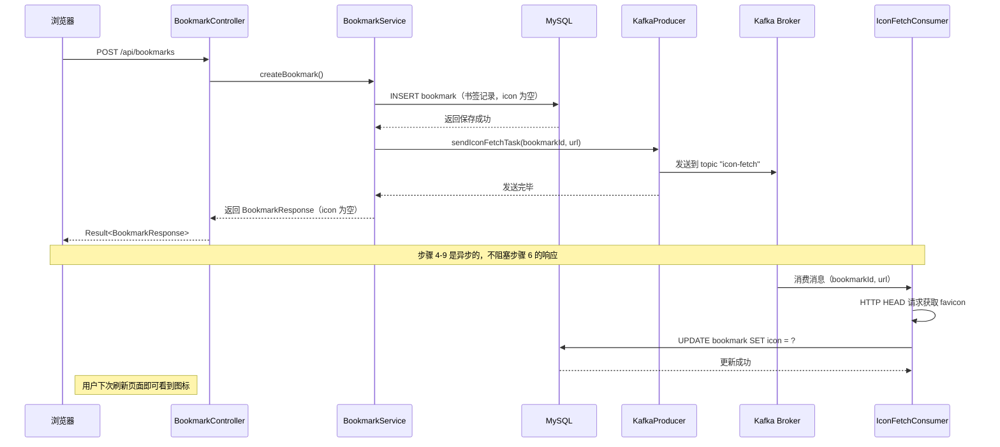

# 第十课：Kafka 消息队列 -- 异步处理的艺术

> 学完这课，你会理解什么是消息队列、Kafka 的核心概念、以及项目中如何用 Kafka 实现异步任务处理和操作日志记录。

---

## 目录

1. [前置知识](#1-前置知识)
2. [概念讲解](#2-概念讲解)
3. [代码逐行解读](#3-代码逐行解读)
4. [关键 Java 语法点](#4-关键-java-语法点)
5. [动手练习建议](#5-动手练习建议)

---

## 1. 前置知识

在进入 Kafka 之前，我们需要先理解几个基础概念：同步与异步、进程间通信。这些概念不仅是理解 Kafka 的前提，也是理解所有分布式系统的基础。

### 1.1 你应该已经会的东西

- **Spring Boot 分层架构**：Controller / Service / Mapper 各层的职责
- **依赖注入**：通过构造器注入使用其他 Bean
- **注解基础**：`@Component`、`@Service`、`@RequiredArgsConstructor` 等
- **MyBatis-Plus 基础**：使用 BaseMapper 进行 CRUD 操作
- **JSON 基础**：知道 JSON 格式 `{"key": "value"}` 是什么
- **定时任务**：上一课学过的 `@Scheduled` 注解

### 1.2 同步 vs 异步

这是理解消息队列最核心的前置概念。

**同步（Synchronous）** 就像"打电话"：

```
你：喂，帮我查一下订单状态
客服：好的，请稍等......（你在等，什么都不能干）
客服：查到了，订单已发货
你：好的，谢谢
```

在同步模式下，调用方发起请求后，必须**一直等待**被调用方处理完毕并返回结果，才能继续做其他事情。等待期间，调用方被"阻塞"了。

**异步（Asynchronous）** 就像"发微信"：

```
你：帮我查一下订单状态（发完消息，你去干别的事了）
......（你该干嘛干嘛，不需要干等）
客服：（后台处理）查到了，订单已发货（过一会儿回复你）
你：（有空了再看消息）好的，谢谢
```

在异步模式下，调用方发起请求后，**不用等待**结果，可以立刻去做别的事情。被调用方在后台处理完毕后，再通过某种方式通知调用方（或者调用方之后主动来查询结果）。

**在我们项目中为什么需要异步？**

回顾上一课，我们用定时任务扫描过期暂存项。扫描到之后，需要删除它们。如果用同步方式，定时任务方法中直接调用 `deleteById()`，扫描和删除是串行的。但如果改用异步方式（通过 Kafka），扫描方只管"通知"有东西要删，删除方在后台处理，两者互不影响。

更重要的是，在创建书签时，我们需要获取网站的图标（favicon）。这个过程要发 HTTP 请求访问目标网站，可能耗时好几秒。如果同步获取，用户点"添加书签"后得等好几秒才能看到结果。用异步方式，用户点击后接口立即返回，图标在后台慢慢获取，用户体验好得多。

### 1.3 进程间通信

在单机应用中，不同组件之间直接调用方法就能通信。但在分布式系统中，不同服务可能运行在不同的机器上，它们之间需要一种"通信机制"来传递信息。

进程间通信（IPC，Inter-Process Communication）的方式有很多：

| 方式 | 类比 | 特点 |
|------|------|------|
| 直接方法调用 | 面对面说话 | 同步、紧耦合 |
| 共享数据库 | 公告栏 | 解耦但性能差 |
| **消息队列** | 快递中转站 | 异步、解耦、可靠 |

消息队列就是其中最常用、最强大的一种方式。接下来我们详细讲解它。

---

## 2. 概念讲解

### 2.1 什么是消息队列（Message Queue）？

**消息队列（MQ）** 是一种进程间通信的方式，就像一个"快递中转站"：

```
寄件人（生产者）  →  快递中转站（消息队列）  →  收件人（消费者）
   张三寄包裹          菜鸟驿站暂存            李四来取包裹
   王五寄包裹          快递柜暂存             赵六来取包裹
```

更具体地说：

- **消息（Message）**：就是快递包裹，里面装着需要传递的数据
- **生产者（Producer）**：就是寄件人，把消息投递到队列
- **消费者（Consumer）**：就是收件人，从队列中取出消息并处理
- **队列（Queue）**：就是快递中转站，暂存消息，等消费者来取

### 2.2 为什么需要消息队列？

消息队列解决三大核心问题：

**一、解耦（Decoupling）**

不用消息队列时：
```
书签Service → 直接调用 → 日志Service
书签Service → 直接调用 → 图标获取Service
```
书签 Service 必须知道日志 Service 和图标获取 Service 的存在。如果日志 Service 改了接口，书签 Service 也得改。

用了消息队列后：
```
书签Service → 发消息到 Kafka → 日志Consumer 自己去取消息处理
                            → 图标Consumer 自己去取消息处理
```
书签 Service 只需要发消息，根本不关心谁会处理、怎么处理。日志 Consumer 挂了？没关系，书签创建照常进行。新增一个处理者？书签 Service 不用改一行代码。

**二、异步处理（Asynchronous）**

不用消息队列时（同步写日志）：
```
用户点击"创建书签"
  → 插入书签到数据库（50ms）
  → 获取网站图标（2000ms，网络请求！）
  → 写操作日志到数据库（50ms）
  → 返回结果给用户
总耗时：约 2100ms
```

用了消息队列后（异步处理）：
```
用户点击"创建书签"
  → 插入书签到数据库（50ms）
  → 发 Kafka 消息（5ms，不等处理结果！）
  → 返回结果给用户
总耗时：约 55ms

（后台异步执行）
  → 图标Consumer：获取网站图标，更新数据库
  → 日志Consumer：写入操作日志
```

用户的等待时间从 2100ms 缩短到 55ms，体验提升巨大！

**三、削峰填谷（Peak Shaving）**

想象一下双十一购物节：平时每秒 100 个订单，双十一零点突然变成每秒 10000 个。如果数据库直接处理，很可能扛不住崩溃。

有了消息队列：
```
用户下单 → 写入消息队列（Kafka 很能扛，每秒百万级）
                          ↓
                    数据库按自己的节奏消费
                    （每秒处理 1000 个，多了的排着队慢慢处理）
```

消息队列就像一个"蓄水池"，短时间内大量涌入的请求可以先暂存起来，消费者按照自己的处理能力慢慢消化。这就是"削峰填谷"——把峰值流量削平，填到低谷时段。

### 2.3 Kafka 是什么？

**Apache Kafka** 是一个分布式消息队列系统，最初由 LinkedIn 开发，后来成为 Apache 基金会的顶级项目。它是目前工业界使用最广泛的消息队列之一。

Kafka 的设计目标：
- **高吞吐量**：每秒可以处理百万级消息
- **持久化**：消息写入磁盘，不怕宕机丢失
- **分布式**：可以部署在多台机器上，天然支持横向扩展
- **高可用**：数据有多份副本，某台机器挂了不影响整体

### 2.4 Kafka 核心概念

让我们用"电视台"来类比 Kafka 的核心概念：

#### Broker（代理服务器） -- 电视台

Kafka 集群中的每一台服务器就是一个 Broker。就像一个电视台有多个发射塔，Kafka 集群有多个 Broker 来分担消息的存储和转发。

我们的项目中，Kafka Broker 部署在飞牛 NAS（192.168.8.6）上，端口 9092。

#### Topic（主题） -- 电视频道

Topic 是消息的分类，就像电视频道。每个频道播不同类型的节目：

| Topic 名称 | 类比频道 | 内容 |
|-----------|---------|------|
| `bookmark-icon-fetch` | 图标频道 | "请帮我获取某个网站的图标" |
| `staging-cleanup` | 清理频道 | "这个暂存项过期了，请删除" |
| `operation-log` | 日志频道 | "用户执行了某某操作，请记录" |

生产者往某个 Topic 发消息，就像电视台往某个频道播节目。消费者订阅某个 Topic，就像观众调到某个频道收看节目。

#### Producer（生产者） -- 节目制作方

生产者是发送消息的程序。在我们的项目中，`KafkaProducer` 类就是生产者，它负责把消息发到指定的 Topic。

#### Consumer（消费者） -- 观众

消费者是接收和处理消息的程序。我们的项目中有三个消费者：

| 消费者类 | 订阅的 Topic | 做什么 |
|---------|-------------|-------|
| `IconFetchConsumer` | `bookmark-icon-fetch` | 获取网站图标并更新数据库 |
| `StagingCleanupConsumer` | `staging-cleanup` | 删除过期的暂存项 |
| `OperationLogConsumer` | `operation-log` | 将操作日志写入数据库 |

#### Consumer Group（消费者组） -- 一群观众合看一台电视

消费者组是 Kafka 中一个重要的概念。同一个消费者组里的多个消费者会**分担**消息（每条消息只被组内一个消费者处理），不同消费者组则会**各自收到一份完整的消息副本**。

举个例子：
```
Topic "bookmark-icon-fetch" 有 100 条消息

消费者组 A：
  - 消费者 A1：处理第 1, 4, 7... 条
  - 消费者 A2：处理第 2, 5, 8... 条
  - 消费者 A3：处理第 3, 6, 9... 条
  合起来正好 100 条，每条只被处理一次

消费者组 B：
  - 消费者 B1：处理全部 100 条
  （B1 独立于 A 组，会收到全部消息的副本）
```

在我们的项目中，所有消费者的 `groupId` 都是 `"hlaia-nav"`，表示它们属于同一个消费者组，每条消息只会被一个实例处理（避免重复操作）。

#### Partition（分区） -- 频道的多个频道号

一个 Topic 可以分成多个 Partition，就像一个频道有多个频道号。分区的作用是**并行处理**——不同的消费者可以同时消费不同分区的消息，提高吞吐量。

```
Topic: bookmark-icon-fetch
  ├── Partition 0：消息 1, 4, 7, 10...
  ├── Partition 1：消息 2, 5, 8, 11...
  └── Partition 2：消息 3, 6, 9, 12...

消费者组：
  消费者 A 处理 Partition 0
  消费者 B 处理 Partition 1
  消费者 C 处理 Partition 2
→ 三个消费者并行工作，速度是单消费者的 3 倍
```

#### Offset（偏移量） -- 播放进度条

每条消息在 Partition 中都有一个唯一的序号，叫 Offset。就像视频播放器的进度条，消费者记录自己消费到了哪条消息（哪个 Offset），下次继续从这个位置消费。

```
Partition 0 中的消息：
  Offset 0: {"bookmarkId": 1, "url": "..."}
  Offset 1: {"bookmarkId": 2, "url": "..."}
  Offset 2: {"bookmarkId": 3, "url": "..."}
                    ↑
          消费者记录：我已经消费到 Offset 1 了
          下次启动后从 Offset 2 开始继续消费
```

这就是为什么消费者重启后不会重复消费消息——它会记住上次消费到哪里了。

### 2.5 本项目中 Kafka 的用途

在本项目中，Kafka 被用于三个异步任务场景：

```
┌────────────────────────────────────────────────────────────────┐
│                     Kafka 消息流全景图                          │
├────────────────────────────────────────────────────────────────┤
│                                                                │
│  ┌──────────────┐     bookmark-icon-fetch     ┌─────────────┐ │
│  │ BookmarkService│ ──── 发送消息 ────→        │IconFetch    │ │
│  │ (创建书签时)  │                             │Consumer     │ │
│  └──────────────┘                              │ → 获取图标   │ │
│                                                │ → 更新数据库  │ │
│  ┌──────────────────┐   staging-cleanup        └─────────────┘ │
│  │ StagingCleanup    │ ──── 发送消息 ────→     ┌─────────────┐ │
│  │ Scheduler (定时)  │                         │StagingClean │ │
│  └──────────────────┘                          │upConsumer   │ │
│                                                │ → 删除记录   │ │
│  ┌──────────────────┐   operation-log          └─────────────┘ │
│  │ OperationLogAspect│ ──── 发送消息 ────→     ┌─────────────┐ │
│  │ (AOP切面自动)     │                         │OperationLog │ │
│  └──────────────────┘                          │Consumer     │ │
│                                                │ → 写入数据库  │ │
│                                                └─────────────┘ │
└────────────────────────────────────────────────────────────────┘
```

**场景一：异步获取网站图标**

当用户创建书签时，后端需要获取该网站的 favicon（标签页小图标）。这个过程需要发 HTTP 请求，可能耗时数秒。通过 Kafka 异步处理，创建书签的接口可以立即返回，不用等待图标获取完成。

**场景二：异步清理过期暂存项**

上一课学过的 `StagingCleanupScheduler` 定时扫描过期暂存项后，不直接删除，而是通过 Kafka 发送清理消息。消费者异步执行删除，即使删除失败 Kafka 也会重试投递。

**场景三：异步记录操作日志**

当用户在系统中执行操作时，AOP 切面自动拦截 Controller 方法，通过 Kafka 发送操作日志消息。消费者在后台将日志写入数据库，不会影响用户请求的响应速度。

---

## 3. 代码逐行解读

现在让我们结合项目的真实代码，从配置到生产者到消费者，完整走一遍 Kafka 的使用流程。

### 3.1 Kafka 配置（application.yml）

首先看开发环境的配置文件 `application-dev.yml`：

```yaml
# 文件：src/main/resources/application-dev.yml

spring:
  kafka:
    # Kafka 服务器地址
    # 开发环境指向飞牛 NAS 的 Kafka 服务
    bootstrap-servers: 192.168.8.6:9092

    # 生产者配置
    producer:
      # 消息 Key 的序列化器
      # 把 Java 的 String 对象转换成二进制数据，才能通过网络发送
      key-serializer: org.apache.kafka.common.serialization.StringSerializer
      # 消息 Value 的序列化器
      value-serializer: org.apache.kafka.common.serialization.StringSerializer

    # 消费者配置
    consumer:
      # 消费者组 ID
      # 同一个组内的消费者会分担消息（每条只被一个消费者处理）
      group-id: hlaia-nav-dev
      # 消息 Key 的反序列化器（把二进制数据还原成 Java String）
      key-deserializer: org.apache.kafka.common.serialization.StringDeserializer
      # 消息 Value 的反序列化器
      value-deserializer: org.apache.kafka.common.serialization.StringDeserializer
      # 当消费者第一次启动时（没有记录 Offset），从哪里开始消费？
      # earliest = 从最早的消息开始（不丢消息）
      # latest   = 只消费启动后的新消息（不处理历史消息）
      auto-offset-reset: earliest
```

逐项解释：

**bootstrap-servers**：Kafka 集群的入口地址。为什么叫"bootstrap"（引导）？因为你只需要提供一个或几个 Broker 的地址，Kafka 客户端就能自动发现集群中的所有 Broker，就像 DNS 服务器一样——你只需要知道一个 DNS 地址，它就能帮你解析所有域名。

**key-serializer / value-serializer**：Kafka 通过网络传输数据，而网络只能传输二进制字节流。序列化器（Serializer）负责把 Java 对象转换成字节流。我们使用 `StringSerializer`，表示消息的 Key 和 Value 都是 String 类型。

**key-deserializer / value-deserializer**：反序列化器（Deserializer）是序列化器的逆过程，把接收到的字节流还原成 Java 对象。

**auto-offset-reset**：消费者第一次启动时，没有任何消费记录（不知道从哪里开始消费）。这个配置告诉消费者："如果没有记录，就从最早的消息开始消费"。这样即使消费者启动晚了，也不会错过历史消息。

再看生产环境的配置 `application-prod.yml`：

```yaml
# 文件：src/main/resources/application-prod.yml

spring:
  kafka:
    # 生产环境使用 Docker 容器名 "kafka" 而不是 IP 地址
    # 因为应用和 Kafka 在同一个 Docker 网络（app-network）中
    # Docker 会自动解析容器名到容器 IP
    bootstrap-servers: kafka:9092
    producer:
      key-serializer: org.apache.kafka.common.serialization.StringSerializer
      value-serializer: org.apache.kafka.common.serialization.StringSerializer
    consumer:
      # 生产环境不带 -dev 后缀
      group-id: hlaia-nav
      key-deserializer: org.apache.kafka.common.serialization.StringDeserializer
      value-deserializer: org.apache.kafka.common.serialization.StringDeserializer
      auto-offset-reset: earliest
```

两个环境的关键区别：

| 配置项 | 开发环境 | 生产环境 | 为什么不同 |
|-------|---------|---------|-----------|
| `bootstrap-servers` | `192.168.8.6:9092` | `kafka:9092` | 开发用 IP 直连，生产用 Docker 容器名 |
| `group-id` | `hlaia-nav-dev` | `hlaia-nav` | 开发和生产使用不同的消费者组，避免互相干扰 |

为什么要区分消费者组？设想一下：如果你在本地开发机启动了应用（连着同一个 Kafka），它的消费者和生产环境同组的消费者会"争抢"消息。开发环境可能把本该生产环境处理的消息给消费了，造成混乱。使用不同的 group-id 就能完全隔离。

### 3.2 Kafka 依赖（pom.xml）

在使用 Kafka 之前，需要在 `pom.xml` 中引入依赖：

```xml
<!-- Kafka 消息队列 -->
<dependency>
    <groupId>org.springframework.kafka</groupId>
    <artifactId>spring-kafka</artifactId>
</dependency>
```

`spring-kafka` 是 Spring 官方提供的 Kafka 集成库，它封装了 Kafka 的原生 Java 客户端（`kafka-clients`），让我们可以用 Spring 的方式（注解、自动配置）来使用 Kafka，而不需要手动创建和管理 Kafka 连接。

测试依赖：

```xml
<!-- Kafka 测试支持 -->
<dependency>
    <groupId>org.springframework.kafka</groupId>
    <artifactId>spring-kafka-test</artifactId>
    <scope>test</scope>
</dependency>
```

`spring-kafka-test` 提供了一个**内嵌的 Kafka 服务器**（Embedded Kafka），在运行单元测试时不需要连接真实的 Kafka 服务，测试更快速、更可靠。

### 3.3 Kafka 生产者 -- KafkaProducer.java

生产者是消息的发送方。在我们的项目中，`KafkaProducer` 类统一封装了所有发送消息的逻辑。

```
文件：src/main/java/com/hlaia/kafka/KafkaProducer.java
```

先看类定义和依赖注入：

```java
@Slf4j                    // Lombok：自动生成 log 对象
@Component                // Spring：注册为 Bean，其他类可以注入使用
@RequiredArgsConstructor  // Lombok：为 final 字段生成构造函数
public class KafkaProducer {

    // Spring 自动注入的 Kafka 消息发送工具
    private final KafkaTemplate<String, String> kafkaTemplate;
```

**KafkaTemplate** 是 Spring Kafka 提供的核心工具类，就像 `JdbcTemplate` 封装了 JDBC 操作一样，`KafkaTemplate` 封装了 Kafka 的发送操作。我们只需要调用 `send()` 方法就能发送消息。

泛型 `<String, String>` 表示：
- 第一个 `String`：消息 Key 的类型
- 第二个 `String`：消息 Value 的类型

**消息的 Key 和 Value 是什么？**

每条 Kafka 消息由两部分组成：
- **Key（键）**：用于消息路由。相同 Key 的消息会被分配到同一个 Partition，保证消息的顺序性。在我们的项目中，Key 是资源 ID（如 `bookmarkId`），保证同一个书签的相关消息按顺序处理。
- **Value（值）**：消息的实际内容，我们使用 JSON 字符串。

接下来看三个发送方法：

**方法一：发送图标获取任务**

```java
public void sendIconFetchTask(Long bookmarkId, String url) {
    // 构造 JSON 格式的消息内容
    String message = "{\"bookmarkId\":" + bookmarkId + ",\"url\":\"" + url + "\"}";
    // 发送消息到 Kafka
    kafkaTemplate.send("bookmark-icon-fetch", bookmarkId.toString(), message);
    log.info("Sent icon fetch task for bookmark {}", bookmarkId);
}
```

逐行分析：

1. `String message = ...`：用字符串拼接构造 JSON 消息。假设 `bookmarkId=123`，`url="https://www.baidu.com"`，拼接结果为：
   ```json
   {"bookmarkId":123,"url":"https://www.baidu.com"}
   ```

2. `kafkaTemplate.send(topic, key, value)`：发送消息到 Kafka。三个参数分别是：
   - `"bookmark-icon-fetch"`：Topic 名称（目标频道）
   - `bookmarkId.toString()`：消息 Key（保证同一书签的消息有序）
   - `message`：消息内容（JSON 字符串）

3. `log.info(...)`：记录日志，方便排查问题。

**注意**：`send()` 方法是异步的！调用后立即返回，不会等待消息被消费者处理完毕。

**方法二：发送暂存区清理任务**

```java
public void sendStagingCleanup(Long stagingItemId, Long userId) {
    String message = "{\"stagingItemId\":" + stagingItemId + ",\"userId\":" + userId + "}";
    kafkaTemplate.send("staging-cleanup", stagingItemId.toString(), message);
    log.info("Sent staging cleanup task for item {}", stagingItemId);
}
```

结构和第一个方法完全一样，只是 Topic 和消息内容不同。

**方法三：发送操作日志**

```java
public void sendOperationLog(Long userId, String action, String target) {
    String message = "{\"userId\":" + userId + ",\"action\":\"" + action
            + "\",\"target\":\"" + target + "\"}";
    kafkaTemplate.send("operation-log", userId.toString(), message);
    log.info("Sent operation log: {} {} by user {}", action, target, userId);
}
```

消息示例：
```json
{"userId":1,"action":"createBookmark","target":"BookmarkController.createBookmark"}
```

### 3.4 谁在调用生产者？

生产者本身不主动发送消息，它被其他组件调用。在我们的项目中有三个调用方：

**调用方一：BookmarkService（创建书签时发送图标获取任务）**

```java
// 文件：src/main/java/com/hlaia/service/BookmarkService.java

@Service
@RequiredArgsConstructor
public class BookmarkService {

    private final BookmarkMapper bookmarkMapper;
    private final KafkaProducer kafkaProducer;  // 注入 Kafka 生产者

    @Transactional
    public BookmarkResponse createBookmark(Long userId, BookmarkCreateRequest request) {
        // ... 构建书签对象、计算排序、插入数据库 ...

        bookmarkMapper.insert(bookmark);

        // 发送 Kafka 异步任务：让消费者去获取网站图标
        kafkaProducer.sendIconFetchTask(bookmark.getId(), bookmark.getUrl());

        return toResponse(bookmark);
    }
}
```

调用流程：用户点击"添加书签" -> Controller 调用 `createBookmark()` -> 插入数据库 -> 发送 Kafka 消息 -> 立即返回结果。获取图标的耗时操作在后台异步进行。

**调用方二：StagingCleanupScheduler（定时扫描过期暂存项后发送清理消息）**

```java
// 文件：src/main/java/com/hlaia/scheduled/StagingCleanupScheduler.java

@Scheduled(fixedRate = 60000)  // 每 60 秒执行一次
public void scanExpiredItems() {
    // 查询所有过期暂存项
    List<StagingItem> expired = stagingItemMapper.selectList(
            new LambdaQueryWrapper<StagingItem>()
                    .le(StagingItem::getExpireAt, LocalDateTime.now()));

    // 遍历每条过期记录，通过 Kafka 发送清理消息
    for (StagingItem item : expired) {
        kafkaProducer.sendStagingCleanup(item.getId(), item.getUserId());
    }
}
```

注意：Scheduler 只负责"发现"过期数据，不负责"删除"。删除由 Kafka 消费者异步完成。

**调用方三：OperationLogAspect（AOP 切面自动拦截 Controller 方法）**

```java
// 文件：src/main/java/com/hlaia/aspect/OperationLogAspect.java

@Around("execution(* com.hlaia.controller.*.*(..)) && " +
        "!execution(* com.hlaia.controller.AuthController.*(..))")
public Object logOperation(ProceedingJoinPoint joinPoint) throws Throwable {
    // 先执行目标方法（Controller 中的业务逻辑）
    Object result = joinPoint.proceed();

    try {
        // 获取方法名作为操作类型
        MethodSignature signature = (MethodSignature) joinPoint.getSignature();
        String action = signature.getMethod().getName();
        String className = signature.getDeclaringType().getSimpleName();

        // 获取当前登录用户 ID
        Long userId = null;
        Authentication auth = SecurityContextHolder.getContext().getAuthentication();
        if (auth != null && auth.getPrincipal() instanceof Long) {
            userId = (Long) auth.getPrincipal();
        }

        String target = className + "." + action;

        // 通过 Kafka 异步发送操作日志
        kafkaProducer.sendOperationLog(userId, action, target);

    } catch (Exception e) {
        // 日志记录失败不应该影响正常的业务请求
    }

    return result;
}
```

这个切面的工作方式：
1. 拦截所有 Controller 方法（排除 AuthController）
2. 先执行业务方法，只有成功后才记录日志
3. 提取方法名、类名、用户 ID 等信息
4. 通过 Kafka 发送操作日志消息
5. 如果日志发送失败（如 Kafka 不可用），用 try-catch 吞掉异常，不影响用户操作

### 3.5 Kafka 消费者 -- OperationLogConsumer.java

消费者是消息的接收方和处理方。我们以 `OperationLogConsumer` 为例进行详细讲解，它是三个消费者中最具代表性的。

```
文件：src/main/java/com/hlaia/kafka/OperationLogConsumer.java
```

**类定义：**

```java
@Slf4j                    // Lombok：自动生成 log 对象
@Component                // Spring：注册为 Bean
@RequiredArgsConstructor  // Lombok：为 final 字段生成构造函数
public class OperationLogConsumer {

    private final OperationLogMapper operationLogMapper;  // 操作日志 Mapper
    private final ObjectMapper objectMapper;              // JSON 解析工具
```

**OperationLogMapper**：上一课学过的 MyBatis-Plus Mapper，继承 `BaseMapper<OperationLog>`，自带 `insert` 方法，用于将日志写入数据库。

**ObjectMapper**：Jackson 库的核心类，用于 JSON 的序列化和反序列化。Spring Boot 会自动创建并注入这个对象，不需要我们手动 `new ObjectMapper()`。

**消费者方法：**

```java
@KafkaListener(topics = "operation-log", groupId = "hlaia-nav")
public void consume(String message) {
    try {
        // 解析 JSON 消息为 JsonNode 对象
        JsonNode node = objectMapper.readTree(message);

        // 创建 OperationLog 实体对象
        OperationLog logEntry = new OperationLog();

        // 设置 userId（可选字段，先检查是否存在）
        logEntry.setUserId(node.has("userId") ? node.get("userId").asLong() : null);

        // 设置 action（必填字段）
        logEntry.setAction(node.get("action").asText());

        // 设置 target（可选字段）
        logEntry.setTarget(node.has("target") ? node.get("target").asText() : null);

        // 设置 createdAt 为当前时间
        logEntry.setCreatedAt(LocalDateTime.now());

        // 插入数据库
        operationLogMapper.insert(logEntry);

    } catch (Exception e) {
        log.error("Failed to save operation log: {}", e.getMessage());
    }
}
```

逐段分析：

**`@KafkaListener` 注解**：这是 Spring Kafka 提供的核心注解，标记一个方法为 Kafka 消费者。它的工作原理是：
1. Spring 启动时扫描到这个注解
2. 自动创建一个 Kafka 消费者线程
3. 订阅指定的 Topic（`"operation-log"`）
4. 当有新消息到达时，自动调用 `consume()` 方法，把消息内容作为参数传入

参数 `topics` 指定要订阅的 Topic，`groupId` 指定消费者组。

**JSON 解析**：

```java
JsonNode node = objectMapper.readTree(message);
```

`readTree()` 把 JSON 字符串解析成一棵"树"结构。`JsonNode` 就像一个 Map，可以通过 key 来获取对应的值。例如：

```java
// 消息内容：{"userId": 1, "action": "createBookmark", "target": "BookmarkController.createBookmark"}

node.get("userId").asLong()   // 返回 1
node.get("action").asText()   // 返回 "createBookmark"
node.get("target").asText()   // 返回 "BookmarkController.createBookmark"
```

**防御性编程**：

```java
node.has("userId") ? node.get("userId").asLong() : null
```

使用 `has()` 先检查字段是否存在，再获取值。有些操作可能没有关联的用户（如系统自动操作），直接 `get("userId")` 会返回 null 的 JsonNode，再调用 `asLong()` 会抛异常。先检查可以避免这个问题。

**时间戳选择**：

```java
logEntry.setCreatedAt(LocalDateTime.now());
```

使用服务器当前时间而非消息发送时间。为什么？因为消费者可能因为 Kafka 消息积压而延迟处理，如果使用消息发送时间，日志时间就不准确了。

**try-catch 包裹**：消费者方法中必须用 try-catch 包裹所有逻辑。如果异常冒泡到 Kafka 框架，会导致：
- Kafka 认为消息处理失败，不断重试投递同一条消息
- 后续消息被阻塞，无法消费
- 严重时消费者完全停止工作

### 3.6 Kafka 消费者 -- IconFetchConsumer.java

这个消费者比 OperationLogConsumer 更复杂，它需要发送 HTTP 请求来获取网站图标。

```
文件：src/main/java/com/hlaia/kafka/IconFetchConsumer.java
```

核心逻辑：

```java
@KafkaListener(topics = "bookmark-icon-fetch", groupId = "hlaia-nav")
public void consume(String message) {
    try {
        // 1. 解析 JSON 消息
        JsonNode node = objectMapper.readTree(message);
        Long bookmarkId = node.get("bookmarkId").asLong();
        String url = node.get("url").asText();

        // 2. 尝试获取 favicon
        String iconUrl = fetchFavicon(url);

        // 3. 如果 favicon 存在，更新数据库
        if (iconUrl != null) {
            Bookmark bookmark = bookmarkMapper.selectById(bookmarkId);
            if (bookmark != null) {
                bookmark.setIconUrl(iconUrl);
                bookmarkMapper.updateById(bookmark);
                log.info("Updated icon for bookmark {}", bookmarkId);
            }
        }
    } catch (Exception e) {
        log.error("Failed to process icon fetch: {}", e.getMessage());
    }
}
```

**为什么检查 `bookmark != null`？**

从发送消息到消费者处理之间有一段时间差。在这段时间内，用户可能已经删除了这本书签。如果不检查 null，`updateById` 会报错。这是一种防御性编程。

**fetchFavicon 方法**：

```java
private String fetchFavicon(String pageUrl) {
    try {
        // 从 URL 中提取域名
        URI uri = new URI(pageUrl);
        String domain = uri.getScheme() + "://" + uri.getHost();

        // 拼接 favicon 地址
        String faviconUrl = domain + "/favicon.ico";

        // 用 Java 11+ 的 HttpClient 发送 HEAD 请求
        HttpClient client = HttpClient.newBuilder()
                .connectTimeout(Duration.ofSeconds(5))
                .followRedirects(HttpClient.Redirect.NORMAL)
                .build();

        HttpRequest request = HttpRequest.newBuilder()
                .uri(URI.create(faviconUrl))
                .timeout(Duration.ofSeconds(5))
                .method("HEAD", HttpRequest.BodyPublishers.noBody())
                .build();

        HttpResponse<Void> response = client.send(request, HttpResponse.BodyHandlers.discarding());

        // 状态码 200 表示 favicon 存在
        if (response.statusCode() == 200) {
            return faviconUrl;
        }
    } catch (Exception e) {
        log.debug("Could not fetch favicon for {}: {}", pageUrl, e.getMessage());
    }
    return null;
}
```

这段代码的核心思路：
1. 从页面 URL（如 `https://www.baidu.com/some-page`）提取域名部分（`https://www.baidu.com`）
2. 拼接 `/favicon.ico` 路径，这是互联网约定俗成的 favicon 存放位置
3. 用 HTTP HEAD 请求（只检查文件是否存在，不下载文件内容）检查这个地址是否返回 200
4. 如果返回 200，说明 favicon 存在，返回 URL

### 3.7 Kafka 消费者 -- StagingCleanupConsumer.java

这是最简单的消费者，只需要解析消息然后删除记录。

```
文件：src/main/java/com/hlaia/kafka/StagingCleanupConsumer.java
```

```java
@KafkaListener(topics = "staging-cleanup", groupId = "hlaia-nav")
public void consume(String message) {
    try {
        JsonNode node = objectMapper.readTree(message);
        Long stagingItemId = node.get("stagingItemId").asLong();

        // 执行删除操作
        stagingItemMapper.deleteById(stagingItemId);

        log.info("Cleaned up expired staging item {}", stagingItemId);
    } catch (Exception e) {
        log.error("Failed to cleanup staging item: {}", e.getMessage());
    }
}
```

逻辑非常简洁：解析消息，拿到暂存项 ID，调用 `deleteById` 删除。如果暂存项已经不存在（被手动删除了），`deleteById` 会返回 0，不会报错。

### 3.8 消息的序列化与反序列化

让我们完整梳理一下一条消息从产生到被消费的完整生命周期：

```
生产者端：
  Java String 对象
    → StringSerializer 序列化（转成字节流）
    → 通过网络发送到 Kafka Broker

Kafka Broker：
  以字节流形式存储在磁盘上
  → 等待消费者来拉取

消费者端：
  从 Broker 拉取字节流
    → StringDeserializer 反序列化（还原成 Java String）
    → 传入 consume(String message) 方法
    → ObjectMapper 把 JSON 字符串解析成 JsonNode
```

在我们的项目中，消息格式统一使用 JSON 字符串，Key 和 Value 的类型都是 `String`。这是一种简单且通用的选择：

- **简单**：不需要为每种消息定义专门的类，用字符串拼接就能搞定
- **通用**：JSON 是跨语言的，任何语言的消费者都能解析
- **调试友好**：JSON 字符串可以直接在 Kafka 管理工具中查看

### 3.9 OperationLog 实体与 Mapper

操作日志最终要写入数据库，对应的实体和 Mapper 如下：

**实体类**（`src/main/java/com/hlaia/entity/OperationLog.java`）：

```java
@Data
@TableName("operation_log")
public class OperationLog {

    @TableId(type = IdType.AUTO)
    private Long id;

    private Long userId;              // 操作用户 ID
    private String action;            // 操作类型，如 "createBookmark"
    private String target;            // 操作目标，如 "BookmarkController.createBookmark"
    private String detail;            // 操作详情（预留字段）
    private String ip;                // 操作者 IP 地址
    private LocalDateTime createdAt;  // 操作时间
}
```

注意日志表的特点：只有 `createdAt` 没有 `updatedAt`，因为日志是只增不改的——记录了就不再修改。

**Mapper 接口**（`src/main/java/com/hlaia/mapper/OperationLogMapper.java`）：

```java
@Mapper
public interface OperationLogMapper extends BaseMapper<OperationLog> {
}
```

继承 `BaseMapper<OperationLog>` 后自动拥有 `insert`、`selectById`、`selectList` 等方法，不需要写任何 SQL。

---

## 4. 关键 Java 语法点

### 4.1 @KafkaListener 注解

```java
@KafkaListener(topics = "operation-log", groupId = "hlaia-nav")
public void consume(String message) { ... }
```

`@KafkaListener` 是 Spring Kafka 提供的注解，标记一个方法为 Kafka 消息监听器。Spring 启动时会：
1. 扫描所有标注了 `@KafkaListener` 的方法
2. 为每个方法创建一个 Kafka 消费者线程
3. 订阅指定的 Topic
4. 当有新消息时，自动调用方法

常用参数：
- `topics`：要订阅的 Topic 名称（可以指定多个）
- `groupId`：消费者组 ID（同一个组内的消费者分担消息）
- `concurrency`：并发消费者数量（默认为 1）

### 4.2 KafkaTemplate 泛型

```java
private final KafkaTemplate<String, String> kafkaTemplate;
```

`KafkaTemplate<K, V>` 有两个泛型参数：
- `K`：消息 Key 的类型（用于路由和分区）
- `V`：消息 Value 的类型（消息的实际内容）

我们使用 `String, String`，表示 Key 和 Value 都是字符串。也可以使用其他类型，如 `String, Object`（Value 是 Java 对象，需要配置 JSON 序列化器）。

### 4.3 JSON 解析：ObjectMapper 与 JsonNode

```java
// 解析 JSON 字符串为 JsonNode 树
JsonNode node = objectMapper.readTree(message);

// 获取字段值
node.get("userId").asLong()     // 转为 Long
node.get("action").asText()     // 转为 String
node.get("count").asInt()       // 转为 int
node.get("enabled").asBoolean() // 转为 boolean

// 检查字段是否存在
node.has("userId")              // 返回 true 或 false

// 嵌套对象
node.get("user").get("name").asText()  // 多层嵌套取值
```

`ObjectMapper` 是 Jackson 库的核心类，`JsonNode` 是 Jackson 表示 JSON 节点的类。可以把 `JsonNode` 想象成一个智能的 Map，它知道自己的值是什么类型（数字、字符串、布尔、对象、数组），并提供对应的转换方法。

### 4.4 @Payload 注解

在更复杂的场景中，消费者方法可以使用 `@Payload` 注解让 Spring 自动反序列化消息：

```java
// 方式一：手动解析（我们项目使用的方式）
@KafkaListener(topics = "operation-log", groupId = "hlaia-nav")
public void consume(String message) {
    JsonNode node = objectMapper.readTree(message);
    // ...
}

// 方式二：自动反序列化（更简洁，需要额外配置）
@KafkaListener(topics = "operation-log", groupId = "hlaia-nav")
public void consume(@Payload OperationLogMessage message) {
    // message 已经是 Java 对象了，不需要手动解析
    Long userId = message.getUserId();
    String action = message.getAction();
}
```

我们项目使用方式一（手动解析），因为消息格式简单，不想为每种消息单独定义一个类。方式二适合消息结构复杂、字段多的场景。

### 4.5 Java 11+ HttpClient

在 `IconFetchConsumer` 中使用了 Java 11 引入的新 HTTP 客户端 API：

```java
// 创建客户端
HttpClient client = HttpClient.newBuilder()
        .connectTimeout(Duration.ofSeconds(5))      // 连接超时：5秒
        .followRedirects(HttpClient.Redirect.NORMAL) // 跟随重定向
        .build();

// 创建请求
HttpRequest request = HttpRequest.newBuilder()
        .uri(URI.create(url))                        // 请求地址
        .timeout(Duration.ofSeconds(5))              // 请求超时：5秒
        .method("HEAD", HttpRequest.BodyPublishers.noBody())  // HEAD 方法
        .build();

// 发送请求
HttpResponse<Void> response = client.send(request, HttpResponse.BodyHandlers.discarding());

// 检查状态码
int statusCode = response.statusCode();  // 200 = 成功
```

**Duration 类**：Java 8 引入的时间长度类，`Duration.ofSeconds(5)` 表示 5 秒钟。用于设置超时时间，比直接写毫秒数更直观。

**HEAD 请求**：只请求响应头，不下载响应体。我们只需要检查 favicon 是否存在（状态码是否为 200），不需要下载文件内容。

---

## 5. 动手练习建议

### 练习一：理解消息流（难度：低）

在纸上画出以下消息的完整流转路径：

1. 用户在书签导航栏中点击"添加书签"
2. 书签创建成功后，图标在几秒后出现

请标注每一步涉及的类和方法。

> **参考答案**



### 练习二：阅读日志（难度：低）

启动项目后，尝试创建一个书签。观察控制台日志，你应该能看到类似这样的输出：

```
Sent icon fetch task for bookmark 123
Updated icon for bookmark 123
```

第一条是生产者发出的，第二条是消费者处理完后打印的。思考：这两行日志之间的时间差说明了什么？

### 练习三：添加一个新的 Kafka 消息（难度：中）

假设你现在要实现"用户删除文件夹时，异步发送一封通知邮件"。请尝试：

1. 在 `KafkaProducer` 中新增一个方法 `sendFolderDeleteNotification(Long userId, Long folderId)`
2. 创建一个新的消费者 `FolderDeleteNotifyConsumer`，订阅新的 Topic `"folder-delete-notify"`
3. 在消费者中先只打印日志（因为发送邮件的实现比较复杂），确认消息流转正确

### 练习四：思考题（难度：中）

1. 如果 Kafka 服务宕机了，用户还能创建书签吗？为什么？
2. 如果消费者处理消息时抛出了异常且没有被 catch，会发生什么？
3. 如果同一个 Topic 有两个不同的消费者组，消息会被处理几次？
4. 为什么消息的 Key 要使用资源 ID（如 bookmarkId）而不是随机值？

### 练习五：进阶探索（难度：高）

研究以下问题（可以查阅 Spring Kafka 官方文档）：

1. 如何配置消息发送确认（acknowledgment），确保消息确实被 Kafka 接收了？
2. 如何实现消费者的手动确认（manual acknowledgment），而不是自动确认？
3. 如果消息格式变得更复杂（嵌套对象、数组），JSON 拼接的方式会有什么问题？应该怎么改进？

---

## 小结

这节课我们学习了：

1. **同步 vs 异步**：同步像打电话（干等），异步像发微信（发完干别的去）
2. **消息队列的三大作用**：解耦、异步处理、削峰填谷
3. **Kafka 核心概念**：
   - Broker = 电视台服务器
   - Topic = 电视频道
   - Producer = 节目制作方
   - Consumer = 观众
   - Consumer Group = 一群观众合看一台电视
   - Partition = 频道的多个频道号
   - Offset = 播放进度条
4. **项目中 Kafka 的三个应用场景**：异步获取图标、异步清理暂存项、异步记录操作日志
5. **代码实现**：
   - 生产者：`KafkaTemplate.send()` 发送消息
   - 消费者：`@KafkaListener` 注解接收消息
   - JSON 解析：`ObjectMapper.readTree()` 解析消息内容

下节课我们将学习 Spring Boot 中另一个重要的基础设施 -- Spring Security 过滤器链的进阶用法，以及如何结合 AOP 实现更灵活的横切关注点处理。

---

> **导航**
> - [上一课：暂存区与定时任务](./08-暂存区与定时任务.md)
> - [返回目录](./README.md)
