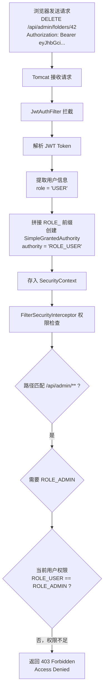

```mermaid
flowchart LR
    A["数据库 user 表<br/>role 字段<br/>值为 'USER' 或 'ADMIN'"]
    -->|"登录时"| B["JwtTokenProvider<br/>generateToken()"]
    B -->|"将 role 写入<br/>JWT Claims"| C["JWT Token<br/>payload 中包含<br/>role: 'USER'"]
    C -->|"后续请求携带 Token"| D["JwtAuthFilter<br/>doFilterInternal()"]
    D -->|"从 Token 提取 role"| E["拼接 ROLE_ 前缀<br/>'USER' → 'ROLE_USER'"]
    E -->|"创建权限对象"| F["SimpleGrantedAuthority<br/>authority = 'ROLE_USER'"]
    F -->|"存入 SecurityContext"| G["SecurityConfig<br/>.requestMatchers('/api/admin/**')<br/>.hasRole('ADMIN')"]
    G -->|"Spring 自动匹配<br/>hasRole → 'ROLE_ADMIN'"| H{"权限比对"}
    H -->|"ROLE_USER == ROLE_ADMIN<br/>匹配成功"| I["放行，执行 Controller"]
    H -->|"ROLE_USER != ROLE_ADMIN<br/>匹配失败"| J["返回 403 Forbidden"]
```

# 阶段 11：管理员功能与权限控制

> **前置要求**：已完成阶段 01-10 的学习，了解三层架构、JWT 认证、Spring Security 过滤器链。
>
> **本阶段目标**：理解 RBAC（基于角色的访问控制）的设计思路，学会管理员 API 的实现方式，掌握 Spring Security 中如何通过 URL 路径实现角色隔离。

---

## 一、前置知识：什么是 RBAC？

### 1.1 从生活类比说起

想象你在一栋办公大楼里工作：

- 每个员工有一张**工牌**（= 用户账号）
- 工牌上标明了你的**职位**（= 角色）：普通员工、部门经理、大楼管理员
- 不同职位能进的**区域不同**（= 权限）：
  - 普通员工：只能进自己的办公室
  - 部门经理：能进部门内所有办公室
  - 大楼管理员：能进任何房间，还能办理新工牌、吊销工牌

这就是 **RBAC**（Role-Based Access Control，基于角色的访问控制）的核心思想：

```
用户（User） → 角色（Role） → 权限（Permission）
```

### 1.2 为什么不直接给用户分配权限？

你可能会问：为什么不跳过"角色"这一层，直接告诉系统"用户张三可以删除文件夹"？

原因有三个：

1. **管理成本高**：如果有 100 个管理员，每个都要单独配置"可以删除文件夹"、"可以查看用户列表"等几十个权限，一旦需要调整，就要改 100 次。
2. **容易出错**：手动给每个人分配权限，很容易遗漏或多余。
3. **角色是权限的"分组"**：把一组相关的权限打包成一个角色（如"管理员"包含所有管理权限），分配时只需要指定角色即可。以后要调整权限，只需修改角色的定义，所有拥有该角色的用户自动生效。

### 1.3 本项目的角色设计

本项目采用了**最简单的两角色模型**：

| 角色 | 说明 | 能做什么 |
|------|------|----------|
| `USER` | 普通用户 | 管理自己的文件夹、书签、暂存区 |
| `ADMIN` | 管理员 | 包含 USER 的所有权限，额外可以管理用户（封禁/解封）、查看/删除任何人的数据 |

**为什么不用更复杂的权限系统？**

很多大型系统会使用"权限表 + 角色表 + 用户-角色关联表"的多对多模型。但对于一个书签导航栏应用来说，只有两种身份（普通用户和管理员），用单字段 `role` 就够了。设计的原则是：**够用就好，不过度设计**。如果将来业务复杂了，再扩展也来得及。

来看 `User` 实体中 `role` 字段的定义：

```java
// 文件：src/main/java/com/hlaia/entity/User.java

/**
 * 角色：用字符串存储
 * "ADMIN" = 管理员，可以管理所有用户
 * "USER"  = 普通用户，只能操作自己的数据
 * 不用 ENUM 类型是因为：VARCHAR 更灵活，以后添加新角色不需要改表结构
 */
private String role;
```

---

## 二、概念讲解：管理员 API 的设计思路

### 2.1 路径隔离：两套 API

本项目的 API 分成两大区域：

| 区域 | 路径前缀 | 权限要求 | 说明 |
|------|----------|----------|------|
| 普通用户 API | `/api/**` | 登录即可 | 每个用户只能操作自己的数据 |
| 管理员 API | `/api/admin/**` | 必须是 ADMIN 角色 | 可以操作所有用户的数据 |

这种**路径前缀隔离**是最常见的权限设计模式之一。它的好处是：

- **清晰直观**：看到 `/api/admin/` 开头就知道这是管理员接口
- **配置简单**：Spring Security 只需要一条规则就能保护所有管理员接口
- **文档友好**：Knife4j 文档中管理员接口会自动分组

### 2.2 横向越权与纵向越权

在讲管理员功能之前，需要理解两个安全概念：

**横向越权（同一层级）**：用户 A 试图访问用户 B 的数据。例如普通用户试图查看别人的文件夹。

- 防御方式：Service 层通过 `getFolderForUser(userId, folderId)` 校验数据归属

**纵向越权（跨角色层级）**：普通用户试图执行管理员操作。例如普通用户试图调用 `/api/admin/users` 查看用户列表。

- 防御方式：Spring Security 的 `hasRole("ADMIN")` 配置

本项目在两层都做了防护：
- Spring Security（URL 级别）→ 防止纵向越权
- Service 层归属校验 → 防止横向越权

### 2.3 管理员 API 一览

```
GET    /api/admin/users                           — 分页查询用户列表
GET    /api/admin/users/{userId}/folders/tree     — 查看指定用户的文件夹树
DELETE /api/admin/folders/{id}                    — 删除任意文件夹
PUT    /api/admin/users/{userId}/ban              — 封禁用户
PUT    /api/admin/users/{userId}/unban            — 解封用户
```

注意管理员接口不需要 `@AuthenticationPrincipal`。普通用户的接口通过它获取"我是谁"，但管理员接口的操作目标不是"自己"，而是 URL 中指定的用户（`@PathVariable Long userId`）。安全性由 SecurityConfig 保证——只有 ADMIN 角色才能访问这些路径。

---

## 三、代码逐行解读

### 3.1 SecurityConfig：URL 级别的角色控制

> 文件：`src/main/java/com/hlaia/config/SecurityConfig.java`

这是整个权限控制的**总入口**。Spring Security 在请求到达 Controller 之前就会检查权限。

```java
// 文件：src/main/java/com/hlaia/config/SecurityConfig.java（节选）

@Bean
public SecurityFilterChain filterChain(HttpSecurity http) throws Exception {
    http
        // ... CSRF、Session 配置省略 ...

        .authorizeHttpRequests(auth -> auth
            // 公开接口：登录、注册、API 文档（不需要登录）
            .requestMatchers("/api/auth/**").permitAll()
            .requestMatchers("/doc.html", "/webjars/**", "/v3/api-docs/**").permitAll()

            // ★ 管理员接口：只有 ADMIN 角色才能访问 ★
            .requestMatchers("/api/admin/**").hasRole("ADMIN")

            // 其他接口：只要登录了就能访问
            .anyRequest().authenticated()
        )

        // 在默认认证过滤器之前插入我们的 JWT 过滤器
        .addFilterBefore(jwtAuthFilter, UsernamePasswordAuthenticationFilter.class);

    return http.build();
}
```

重点理解 `.requestMatchers("/api/admin/**").hasRole("ADMIN")` 这一行：

- `requestMatchers("/api/admin/**")`：匹配所有以 `/api/admin/` 开头的 URL
- `hasRole("ADMIN")`：要求当前用户拥有 ADMIN 角色
- Spring Security 会检查 SecurityContextHolder 中的权限列表，查找是否包含 `"ROLE_ADMIN"`

**规则匹配的顺序很重要**：Spring Security 从上到下匹配，第一个命中的规则生效。所以管理员路径必须写在 `anyRequest().authenticated()` 之前。如果把 `anyRequest()` 放在前面，所有请求都只需登录即可，`hasRole("ADMIN")` 永远不会被检查。

**三种可能的结果**：

| 用户状态 | 结果 |
|----------|------|
| 未携带 Token | 401 Unauthorized（未认证） |
| Token 中角色是 USER | 403 Forbidden（权限不足） |
| Token 中角色是 ADMIN | 放行，请求到达 Controller |

### 3.2 JwtAuthFilter：角色信息如何进入 SecurityContext

> 文件：`src/main/java/com/hlaia/security/JwtAuthFilter.java`

SecurityConfig 怎么知道当前用户的角色？答案在 JwtAuthFilter 中。这个过滤器从 JWT Token 中提取角色，并写入 Spring Security 的上下文。

```java
// 文件：src/main/java/com/hlaia/security/JwtAuthFilter.java（节选）

// 从 Token 中提取用户 ID 和角色
Long userId = jwtTokenProvider.getUserIdFromToken(token);
String role = jwtTokenProvider.getRoleFromToken(token);

// 创建认证令牌，携带用户信息和权限
UsernamePasswordAuthenticationToken authentication =
        new UsernamePasswordAuthenticationToken(
                userId,                     // principal：用户 ID
                null,                       // credentials：不需要密码
                Collections.singletonList(   // authorities：权限列表
                        new SimpleGrantedAuthority("ROLE_" + role)
                )
        );

// 写入 SecurityContext，后续所有 Security 组件都能读取
SecurityContextHolder.getContext().setAuthentication(authentication);
```

关键行是 `new SimpleGrantedAuthority("ROLE_" + role)`：

- 数据库中存储的角色是 `"ADMIN"` 或 `"USER"`（没有前缀）
- Spring Security 的内部约定要求权限名加 `"ROLE_"` 前缀
- 所以 `"ADMIN"` 变成 `"ROLE_ADMIN"`
- `hasRole("ADMIN")` 实际上是在查找 `"ROLE_ADMIN"`

这就是为什么数据库里存 `"ADMIN"` 而不是 `"ROLE_ADMIN"`——保持数据的干净，前缀由代码自动补上。

### 3.3 角色信息的完整流转

让我们把整个链路串起来，看角色信息从注册到权限检查的完整过程：

```
注册时：
  AuthService.register() → user.setRole("USER") → 写入数据库

登录时：
  AuthService.login()
    → UserDetailsServiceImpl 从数据库查到 role="ADMIN"
    → 返回 UserDetails，authorities 包含 "ROLE_ADMIN"
    → AuthService.generateAuthResponse()
      → jwtTokenProvider.generateAccessToken(userId, username, "ADMIN")
      → JWT Payload 中写入 claim("role", "ADMIN")
    → 返回 Token 给前端

每次请求：
  JwtAuthFilter.doFilterInternal()
    → jwtTokenProvider.getRoleFromToken(token)  → 得到 "ADMIN"
    → new SimpleGrantedAuthority("ROLE_" + "ADMIN")  → "ROLE_ADMIN"
    → 写入 SecurityContextHolder

权限检查：
  SecurityConfig.filterChain()
    → requestMatchers("/api/admin/**").hasRole("ADMIN")
    → hasRole("ADMIN") 自动匹配 "ROLE_ADMIN"
    → SecurityContext 中有 "ROLE_ADMIN" → 放行
```

### 3.4 AdminController：管理员 API 入口

> 文件：`src/main/java/com/hlaia/controller/AdminController.java`

```java
@RestController
@RequestMapping("/api/admin")
@RequiredArgsConstructor
@Tag(name = "Admin", description = "Admin management APIs")
public class AdminController {

    private final AdminService adminService;

    // 分页查询用户列表
    @GetMapping("/users")
    public Result<Page<UserResponse>> listUsers(
            @RequestParam(defaultValue = "1") int page,
            @RequestParam(defaultValue = "20") int size) {
        return Result.success(adminService.getUserList(page, size));
    }

    // 查看指定用户的文件夹树
    @GetMapping("/users/{userId}/folders/tree")
    public Result<List<FolderTreeResponse>> getUserFolders(@PathVariable Long userId) {
        return Result.success(adminService.getUserFolderTree(userId));
    }

    // 删除任意文件夹
    @DeleteMapping("/folders/{id}")
    public Result<Void> deleteFolder(@PathVariable Long id) {
        adminService.deleteUserFolder(id);
        return Result.success();
    }

    // 封禁用户
    @PutMapping("/users/{userId}/ban")
    public Result<Void> banUser(@PathVariable Long userId) {
        adminService.banUser(userId);
        return Result.success();
    }

    // 解封用户
    @PutMapping("/users/{userId}/unban")
    public Result<Void> unbanUser(@PathVariable Long userId) {
        adminService.unbanUser(userId);
        return Result.success();
    }
}
```

注意几个设计要点：

**1. `@RequestMapping("/api/admin")` 统一前缀**

所有方法的完整路径都自动加上 `/api/admin` 前缀。例如 `@GetMapping("/users")` 的完整路径是 `/api/admin/users`。这与 SecurityConfig 中的 `/api/admin/**` 规则完美对应。

**2. `@RequestParam` vs `@PathVariable`**

```java
@RequestParam(defaultValue = "1") int page    // 从查询参数获取：?page=2
@PathVariable Long userId                      // 从 URL 路径获取：/users/5/...
```

- `@RequestParam`：适合过滤、分页等可选参数
- `@PathVariable`：适合定位具体资源的必选参数

**3. ban 和 unban 为什么用 PUT 而不是 POST？**

封禁/解封本质上是"更新用户的状态字段"，PUT 的语义是"更新已有资源"，比 POST 更准确。而且 PUT 是幂等的——封禁一个已经封禁的用户，结果不变。

### 3.5 AdminService：管理员业务逻辑

> 文件：`src/main/java/com/hlaia/service/AdminService.java`

AdminService 的核心特点是：**不需要做归属校验**。因为调用者一定是 ADMIN（SecurityConfig 已保证），管理员有权操作任何用户的数据。

#### 分页查询用户列表

```java
public Page<UserResponse> getUserList(int page, int size) {
    // 第一步：查数据库，按创建时间倒序
    Page<User> userPage = userMapper.selectPage(
            new Page<>(page, size),
            new LambdaQueryWrapper<User>().orderByDesc(User::getCreatedAt));

    // 第二步：创建 DTO 分页对象，保留分页信息
    Page<UserResponse> result = new Page<>(
            userPage.getCurrent(), userPage.getSize(), userPage.getTotal());

    // 第三步：Entity → DTO 转换（遍历列表中的每个 User）
    result.setRecords(
            userPage.getRecords().stream()
                    .map(this::toUserResponse)
                    .collect(Collectors.toList()));
    return result;
}
```

这里有一个重要的数据转换过程：`Page<User>` → `Page<UserResponse>`。为什么不直接返回 `User` 实体？因为 `User` 包含 `password` 字段，绝不能暴露给前端。

来看 `toUserResponse` 方法：

```java
private UserResponse toUserResponse(User user) {
    UserResponse dto = new UserResponse();
    dto.setId(user.getId());
    dto.setUsername(user.getUsername());
    dto.setEmail(user.getEmail());
    dto.setRole(user.getRole());
    dto.setStatus(user.getStatus());
    dto.setCreatedAt(user.getCreatedAt());
    // 注意：没有 set password！这是刻意省略的
    return dto;
}
```

这里采用**手动逐字段复制**而不是 `BeanUtils.copyProperties`，原因是安全层面的考虑：如果以后 `UserResponse` 不小心加了 `password` 字段，`BeanUtils` 会悄悄把密码复制过去。手动复制虽然代码多一点，但能保证密码永远不会出现在响应中。

#### 封禁/解封用户

```java
@Transactional
public void banUser(Long userId) {
    User user = userMapper.selectById(userId);
    if (user == null) throw new BusinessException(ErrorCode.USER_NOT_FOUND);
    user.setStatus(1);   // 1 = 封禁
    userMapper.updateById(user);
}

@Transactional
public void unbanUser(Long userId) {
    User user = userMapper.selectById(userId);
    if (user == null) throw new BusinessException(ErrorCode.USER_NOT_FOUND);
    user.setStatus(0);   // 0 = 正常
    userMapper.updateById(user);
}
```

封禁后用户无法登录，因为在登录流程（`UserDetailsServiceImpl.loadUserByUsername`）中会检查状态：

```java
if (user.getStatus() == 1) {
    throw new BusinessException(ErrorCode.USER_BANNED);
}
```

**为什么用两个方法（ban + unban）而不是一个 toggleStatus？**

1. 语义清晰——看方法名就知道是封禁还是解封
2. 安全性高——前端明确指定操作类型，避免"点错了"的误操作
3. API 更直观——`PUT /ban` 和 `PUT /unban` 比 `PATCH /toggle-status` 更明确

#### 查看用户的文件夹树

```java
public List<FolderTreeResponse> getUserFolderTree(Long userId) {
    return folderService.getFolderTree(userId);
}
```

这里直接复用了 `FolderService.getFolderTree(userId)`。这就是 Service 层分层的优势：普通用户获取自己的文件夹树（userId 从 Token 中取），管理员获取任意用户的文件夹树（userId 从 URL 中取），但底层用的是同一个方法。

---

## 四、关键 Java 语法点

### 4.1 CommandLineRunner / ApplicationRunner

本项目的设计文档提到管理员账号通过 CommandLineRunner 创建。这个接口是什么？

```java
// 示例代码（非本项目实际文件，用于讲解概念）

@Component
public class AdminInitializer implements CommandLineRunner {

    private final UserMapper userMapper;
    private final PasswordEncoder passwordEncoder;

    // 构造器注入省略...

    @Override
    public void run(String... args) {
        // 检查是否已存在管理员账号
        User existing = userMapper.selectOne(
                new LambdaQueryWrapper<User>().eq(User::getRole, "ADMIN"));

        if (existing == null) {
            // 创建默认管理员
            User admin = new User();
            admin.setUsername("admin");
            admin.setPassword(passwordEncoder.encode("admin123"));
            admin.setRole("ADMIN");
            admin.setStatus(0);
            userMapper.insert(admin);
            log.info("默认管理员账号已创建");
        }
    }
}
```

**CommandLineRunner 是什么？**

- Spring Boot 提供的接口，应用启动完成后自动执行 `run` 方法
- 适合做**一次性初始化**工作：创建默认管理员、初始化配置数据等
- `String... args` 是应用启动时的命令行参数

**ApplicationRunner 和 CommandLineRunner 的区别？**

| 接口 | 参数类型 | 区别 |
|------|----------|------|
| `CommandLineRunner` | `String... args` | 原始命令行参数 |
| `ApplicationRunner` | `ApplicationArguments args` | 封装后的参数对象，支持 `--key=value` 格式 |

功能完全一样，ApplicationRunner 只是参数更结构化。一般用 CommandLineRunner 就够了。

**为什么在代码中创建管理员而不是 SQL 脚本？**

这是一个常见的设计选择。在 Flyway 迁移脚本 `V2__init_admin.sql` 中只有一行注释：

```sql
-- Admin user will be created programmatically via AdminInitializer CommandLineRunner
-- to ensure BCrypt password hash is generated correctly by the application.
```

原因是：

1. **BCrypt 加密需要应用代码**：每次加密结果不同（自带随机盐值），在 SQL 中无法生成正确的 BCrypt 密文
2. **幂等性**：代码中可以"先查后建"，避免重复创建。SQL 脚本重复执行会报错
3. **配置灵活**：密码可以从配置文件或环境变量读取，不需要硬编码在 SQL 中

### 4.2 "ROLE_" 前缀约定

Spring Security 的角色命名有一个容易踩坑的约定：

```java
// JwtAuthFilter 中：
new SimpleGrantedAuthority("ROLE_" + role)  // "ADMIN" → "ROLE_ADMIN"

// UserDetailsServiceImpl 中：
String authority = "ROLE_" + user.getRole()  // "ADMIN" → "ROLE_ADMIN"

// SecurityConfig 中：
.hasRole("ADMIN")  // 内部自动补 "ROLE_"，实际匹配 "ROLE_ADMIN"
```

| 写法 | 含义 | 匹配的权限名 |
|------|------|--------------|
| `hasRole("ADMIN")` | 检查角色 | `ROLE_ADMIN` |
| `hasAuthority("ROLE_ADMIN")` | 检查权限 | `ROLE_ADMIN`（精确匹配） |
| `hasRole("ROLE_ADMIN")` | **错误写法** | `ROLE_ROLE_ADMIN`（重复前缀！） |

记住：`hasRole()` 会自动加前缀，`hasAuthority()` 不加。所以数据库中存 `"ADMIN"` 就对了，不要存 `"ROLE_ADMIN"`。

### 4.3 Lambda 在 Security 配置中的使用

SecurityConfig 中的链式配置大量使用了 Lambda 表达式。来看两个例子：

```java
// 示例 1：authorizeHttpRequests 的 Lambda
.authorizeHttpRequests(auth -> auth
    .requestMatchers("/api/admin/**").hasRole("ADMIN")
    .anyRequest().authenticated()
)
```

这里 `auth` 是 Spring Security 提供的"授权配置器"对象。Lambda 的写法等价于：

```java
// 等价的传统写法（更冗长）
http.authorizeHttpRequests(new Customizer<AuthorizeHttpRequestsConfigurer<HttpSecurity>.AuthorizationManagerRequestMatcherRegistry>() {
    @Override
    public void customize(AuthorizeHttpRequestsConfigurer<HttpSecurity>.AuthorizationManagerRequestMatcherRegistry auth) {
        auth.requestMatchers("/api/admin/**").hasRole("ADMIN");
        auth.anyRequest().authenticated();
    }
});
```

Lambda 让代码更简洁，语义也更清晰：`auth -> auth.规则1().规则2()` 读起来就是"对 auth 设置这些规则"。

```java
// 示例 2：sessionManagement 的 Lambda
.sessionManagement(session ->
        session.sessionCreationPolicy(SessionCreationPolicy.STATELESS)
)
```

### 4.4 分页参数的默认值处理

```java
@GetMapping("/users")
public Result<Page<UserResponse>> listUsers(
        @RequestParam(defaultValue = "1") int page,
        @RequestParam(defaultValue = "20") int size) {
```

`defaultValue` 的好处：前端不传这些参数时，后端自动使用默认值。比 `required = false` + 手动判空更简洁。

请求示例：

```
GET /api/admin/users               → page=1, size=20（都用默认值）
GET /api/admin/users?page=3        → page=3, size=20（size 用默认值）
GET /api/admin/users?page=2&size=50 → page=2, size=50（都用传入值）
```

---

## 五、动手练习建议

### 练习 1：理解权限检查流程

在纸上画出以下请求的完整处理流程：

```
DELETE /api/admin/folders/42
Authorization: Bearer eyJhbGci...(USER 角色的 Token)
```

提示：请求会经过哪些组件？最终返回什么状态码？

> **参考答案**



### 练习 2：添加新的管理员接口

尝试添加一个管理员接口：`GET /api/admin/users/{userId}/bookmarks`，用于查看指定用户的所有书签。

提示：
1. 在 AdminController 中添加方法
2. 需要新建一个 BookmarkService 方法或在 AdminService 中实现
3. 不需要修改 SecurityConfig（路径已匹配 `/api/admin/**`）

### 练习 3：思考题

1. 如果管理员封禁了自己，会发生什么？如何防止这种情况？
2. 如果将来需要添加第三种角色（如 `MODERATOR`，版主，可以删除违规内容但不能管理用户），需要修改哪些地方？
3. 为什么 `AdminService.deleteUserFolder` 只做了物理删除，没有级联删除子文件夹？如果要实现级联删除，应该怎么做？

### 练习 4：代码追踪

打开 `UserDetailsServiceImpl.java`，找到 `"ROLE_" + user.getRole()` 这一行。然后搜索项目中所有出现 `ROLE_` 的地方，画出角色从数据库到权限检查的完整流转图。

> **参考答案**



---

## 六、本阶段知识点总结

| 知识点 | 说明 |
|--------|------|
| RBAC | 基于角色的访问控制，用户 → 角色 → 权限 |
| 路径隔离 | `/api/admin/**` 与 `/api/**` 分开管理 |
| hasRole("ADMIN") | Spring Security 的角色检查，自动匹配 `ROLE_ADMIN` |
| SimpleGrantedAuthority | 权限对象，需要加 `ROLE_` 前缀 |
| 横向越权 | 同角色用户间的数据隔离（Service 层校验） |
| 纵向越权 | 低角色访问高角色功能（SecurityConfig 拦截） |
| CommandLineRunner | 应用启动后执行的初始化逻辑 |
| @RequestParam(defaultValue) | 分页参数的默认值处理 |
| Entity → DTO 转换 | 手动复制字段，确保密码不泄露 |
